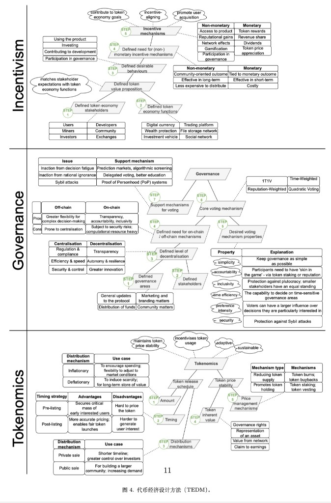

**说明：** 下文是对学术论文 [*Designing a Token Economy: Incentives, Governance, and Tokenomics*](https://arxiv.org/abs/2602.09608)的阅读梳理与结构化解说。

---

## 1. 行业痛点与研究动机

文章首先点明了当前 Web3 与区块链行业的一个核心矛盾：代币的作用已从早期简单的价值转移，演进为支撑去中心化自治组织（DAO）与锚定现实资产的关键工具；代币打破了传统 Web2 平台对用户数据的中心化垄断。

**痛点在于：现有的代币设计缺乏系统性与工程化指导。** 许多项目的代币设计是割裂的——要么偏重发币（Tokenomics），要么偏重投票（Governance），缺少把这些环节串联起来的端到端（end-to-end）设计指南。文中以 2022 年 **Luna 与 TerraUSD（UST）的「死亡螺旋」**作为反面教材：产品设计缺陷与风险管理不足叠加，在意外冲击下可导致生态崩盘与投资者重大损失。

为解决上述「系统性崩溃」风险，作者指出，健康的代币经济必须将以下三个维度结构化整合，缺一不可：

- **激励机制（Incentives）：** 心理与行为层面——如何用奖惩引导参与者行为，使个体逐利与生态长期目标一致。
- **治理（Governance）：** 政治与组织层面——权力如何分配与行使；在 DAO 中常体现为链上投票、链下协调及二者如何共同决定金库与协议升级。
- **代币经济学（Tokenomics）：** 金融与数学层面——代币生命周期规则：发行、分配、资源配置与销毁（通缩）等。

针对上述问题，本文提出 **TEDM（Token Economy Design Method，代币经济设计方法）** 的结构化框架。文章强调该框架基于**设计科学研究（DSR）**得出，并以真实商业生态 **Currynomics**（与房地产潜在资产关联的稳定币体系）为案例进行验证与打磨。

引言末尾将全文导航为若干研究问题：**核心问题**——如何用系统化、透明的方式将「激励、治理、代币经济学」三者一体设计；**子问题**——在激励、治理与代币经济学各自路径上，设计者须考虑哪些关键因素、在哪些节点必须决策。

---

## 2. 论文整体逻辑拓扑（章节骨架）

在处理这类系统工程文献时，把握宏观骨架有助于阅读。本文在宏观上遵循 **「提出问题 → 构建三支柱框架 → 代入实证检验 → 总结」** 的推导路径。若将其映射到基于设计科学（DSR）的常见章节划分，逻辑拓扑可概括为：

### 2.1 引言与问题确立（第 1 节）

确立出发点：当前代币设计碎片化，缺乏端到端的系统工程指导（文中亦引用 Luna 等案例），从而引出核心目标——开发名为 **TEDM** 的系统化指南。

### 2.2 理论基石与测试场（第 2 节：初步研究）

在直接进入方法论之前，论文先建立推导的「公理空间」与评估环境：

- **方法论基调：** 采用 DSR；明确 TEDM 不是定量预测模型，而是定性设计工程指南。
- **文献收敛：** 将零散研究收敛到激励、治理、代币经济学三个维度。
- **测试场：** 引入 **Currynomics**（房地产支撑的 RWA 相关生态）作为后续推导与评估的约束情境。

### 2.3 核心架构（第 3 节：TEDM）

对应「按三步走」的心智内核，文章给出分步施工图：

- **第一支柱：激励机制（5 步）**——系统中有谁、系统需要什么、用什么（货币或声誉等）驱动行为。
- **第二支柱：治理（7 步）**——权力分配；链上/链下、去中心化程度、投票机制（如时间加权、二次方投票等）。
- **第三支柱：代币经济学（5 步）**——账本上的数学与金融设计：发行（通胀/上限）、分配（公募/私募等）、价值捕获、管理流通量的工具箱。

### 2.4 实证与对抗性评估（第 4 节：评估）

较「套用案例」更严密，包含多重交叉验证：

- **案例演示：** 将第 3 节框架约束在 Currynomics 的现实条件中走一遍。
- **专家访谈：** 外部专家从完整性、简洁性、可操作性等维度评判。
- **横向解剖：** 文中还将 TEDM 用于分析已成熟的 DEX（如 **Curve Finance** 与 **Uniswap**），以讨论框架的跨项目分析适用性（具体节号与篇幅以 PDF 为准）。

### 2.5 结论与未来工作（第 5 节）

总结成果并划定边界：承认定性框架的局限——不能替代后期的定量仿真与参数调优——并为后续研究留出接口。

**一言以蔽之：** 论文旨在提供一份从理论抽象到工程落地的 **标准操作程序（SOP）** 式的指南。

---

## 3. 设计科学研究（DSR）何以适用

论文将 **设计科学研究（DSR）** 定位为适合分析「社会技术系统」（如代币经济）的一类方法论。与自然科学的解释/预测取向不同，设计科学的核心在于**创造**：通过构建并评估**人造制品（Artifacts）**来解决实际问题。

在本文中，DSR 的产物即 **TEDM 框架**——指导如何设计代币经济的指南体系。

完整的设计科学研究通常交织三类环节（文中常以示意图概括）：

- **环境（Environment）——相关性：** 识别现实业务需求、利益相关方目标与技术约束（如链上协议能力），使研究锚定真实痛点。
- **知识库（Knowledge Base）——严谨性：** 援引既有理论、分类与研究方法，为新方案提供学术基础。
- **设计研究（核心循环）：** 在此反复 **开发（Develop）—评估（Evaluate）—精炼（Refine）** 人造制品。

在 DSR 范式下，评价成果往往不采用「绝对正确」单一标准，而采用多维效用型标准。本文采用（与前述专家评估一致的）常见维度，例如：

1. **完整性（Completeness）：** 是否覆盖关键决策点。  
2. **简洁性（Simplicity）：** 在可用前提下是否足够精简。  
3. **可理解性（Understandability）：** 结构与步骤是否清晰。  
4. **操作可行性（Operational Feasibility / Operability）：** 能否在实际约束下指导实践。  
5. **感知准确率（Perceived Accuracy）：** 导向与权衡是否符合专家直觉与现实情境。

简言之，DSR 强调在特定情境下的**分析可迁移性**：方法在 A 项目可用时，其逻辑是否仍能辅助分析 B 项目——而非单纯追求统计意义上的普遍定律。

---

## 4. 初步研究：定位、构建路径与评估手段

TEDM **并非**用于像期权定价模型那样预测代币价格的 **预测模型**；其价值在于将早期设计须面对的 **决策点、权衡与风险** 显性化。

**构建与演进路径**可概括为：

1. **降维与聚类：** 从文献中提取概念，收敛为激励、治理、代币经济学三大维度。  
2. **案例驱动迭代：** 将初步框架代入 **Currynomics** 打磨，而非在真空中闭合。  
3. **分析可迁移性：** 案例目的不是证明某一商业结果必然最优，而是检验 TEDM 的结构化分析是否在多变情境下仍清晰可用。

**数据采集与评估：** 采用 **半结构化访谈**（项目方与外部专家）；转录后辅以 **主题分析**（如使用 MAXQDA 等工具）。在具体阐述中，作者亦借助 **智能体导向建模（Agent-Oriented Modeling, AOM）** 等符号系统，将目标层层分解，使社会—技术要素更可操作。

---

## 5. Luna / UST：死亡螺旋与代币经济学教训

2022 年 5 月前后 Luna 与 UST 的崩盘，是加密史上著名的 **死亡螺旋** 案例之一，短期内市值蒸发规模巨大。将其机制与代币经济学联系起来，有助于理解为何「风险管理不足常与产品设计缺陷相伴」。

### 5.1 核心机制：双币与铸销套利

- **UST：** 算法稳定币，目标锚定 1 美元。  
- **Luna：** 治理与吸收波动的原生代币，价格浮动。

维持锚定的主要手段是协议内 **铸销/套利**：协议在设计上将 1 UST 与 1 美元在一定规则下互换。

- **扩张期（UST 需求旺、价格高于锚定）：** 套利者可在体系内用价值约 1 美元的 Luna 换取 UST 并在市场卖出，增发 UST 供给使价格回落。  
- **收缩期（UST 需求弱、价格低于锚定）：** 套利者买入折价 UST，在协议侧销毁并换取新铸造的、按预言机计价约等值美元的 Luna 再卖出，压缩 UST 供给。

该系统依赖 **内生抵押**：用协议自有资产（Luna）吸收稳定币债务波动，而非足额外部储备。

### 5.2 螺旋的数学直觉

收缩阶段，为吸收 UST 抛压而 **增发 Luna** 的规模与 Luna 价格相关：价格越低，为兑付等量美元价值所需的新增 Luna 越多；极端情形下，市值与债务关系断裂——**Luna 总市值不足以覆盖流通 UST 所隐含索取权** 时，套利与信心可同时瓦解，UST 脱锚、Luna 供给失控。

### 5.3 与代币经济学、激励的关系

- **尾部风险：** 顺风模型在逆风未必成立；缺乏足够缓冲（如外部储备或熔断）时，边界条件可触发系统性失灵。  
- **激励扭曲：** 生态内例如 Anchor 对 UST 存款的极高名义收益，曾人为放大 UST 需求；补贴不可持续时资金撤离，可与铸销机制叠加放大波动。

因此 Luna 案例常被用作代币经济设计的反面教材：**底层经济学假设与激励结构若存在结构性漏洞，单靠市场情绪与资金流入难以在极端情形下阻止崩盘。**

---

## 6. 文献收口、Currynomics 与 TEDM 第一支柱（激励）

### 6.1 为何需要 TEDM（文献侧）

过往研究往往偏碎片化：有的偏重货币政策侧（空投、防女巫），有的偏重公司金融视角（回购、ICO 估值）；亦有流程式提议但局限于 ICO 等场景，未将治理与激励深度并入同一套端到端方法。**TEDM 的意义在于整合三支柱。**

### 6.2 试金石：Currynomics 与 RWA 复杂度

**Currynomics** 作为验证情境，涉及 **RWA（真实世界资产）** 映射，设计难度通常高于纯链上算法稳定币叙事。

- **Redcurry：** 并非简单锚定美元，而与商业房地产投资组合的 **净资产价值（NAV）** 等参照相关联（具体定义以论文为准）。  
- **收益逻辑：** 链上载体与房地产组合现金流/策略的关系由论文与项目披露界定；Redcurry 扮演连接传统资本与加密经济的桥梁角色之一。

文中常以架构图区分：**RedCurry Holding**（资产与发行侧）、**Currynomics Labs OÜ**（运营与服务）、**Currynomics DAO**（治理与金库来源之一）。核心张力在于：**在外部存在大量传统替代品时如何建立信任；以及如何避免治理捕获（大户操控 DAO 掠夺系统）。** 因此代币发行节奏与分配须极端审慎。

### 6.3 TEDM：激励机制（五步骨架）

TEDM 重申其 **定性、基于设计命题** 的定位，优先 **可操作性** 与 **可解释性**。

**激励机制**回答：**系统要什么，如何让参与者在自利行为中趋向系统目标。** 文中将其拆为三层目标与五步（与表 2 一致）：

**目标一：定义代币经济的价值主张**

- **步骤 1：** 识别利益相关者（用户、流动性提供者、开发者等）。  
- **步骤 2：** 定义代币经济的功能（系统提供何种服务）。

**目标二：识别有助于系统效用的行为**

- **步骤 3：** 确定期望行为（希望各方做什么）。

**目标三：选择促进期望行为的激励机制**

- **步骤 4：** 激励机制的类型（代币奖励、手续费、惩罚/削减等）。  
- **步骤 5：** 具体说明机制（参数与执行逻辑）。

在进入代码与合约之前，设计者须先完成上述「灵魂拷问」式的对齐。

---

## 7. TEDM 全局图谱与 Currynomics：激励侧前三步

论文中的 **TEDM 总图**（文中 **图 4**）将复杂系统降维为三条并行的决策链，沿 **Step** 递进。下图即该总览：**激励机制（Incentivism）** 五步、**治理（Governance）** 七步、**代币经济学（Tokenomics）** 五步，对应文中 Step 与表格要点。

*图示来源：Kivilo et al.,「Designing a Token Economy: Incentives, Governance, and Tokenomics」, [arXiv:2602.09608](https://arxiv.org/abs/2602.09608)；转载仅供读书笔记说明，著作权归原作者。*

- **上层——激励机制：** 谁参与 → 系统价值何在 → 期望行为 → 金钱/非金钱手段 → 落地为具体机制（分红、声誉、产品使用权等）。  
- **中层——治理：** 治理域 → 主体 → 去中心化程度 → 链下 vs 链上 → 投票机制（1T1V、时间加权、二次方投票等）。  
- **下层——代币经济学：** 发行节奏与数量 → 分配 → 价值来源 → 流通管理工具（销毁、回购、质押锁仓等）。

**Currynomics 示例（激励侧前三步）：**

1. **利益相关者：** 用户（持有 Redcurry 求稳健等）、持牌分销等合作伙伴、Labs 开发者、DAO 社区成员、早期投资者等——诉求往往冲突，激励设计旨在平衡。  
2. **代币经济功能：** 偏金融化——抗通胀储蓄、支付、以及与房地产组合增值叙事相关的投资载体等（以论文表述为准）。  
3. **期望行为：** 例如对用户——将代币视为长期价值储存，并抑制在低于净资产参考价时的恐慌抛售；明确此后才好设计锁仓激励或抛售相关的规则集合。

---

## 8. 第一支柱收尾与治理框架起点（激励步骤 4–5；治理步骤 1、2、4）

若将「激励」理解为回答 **如何让人愿意参与**，则 **治理** 回答的是 **系统权力如何分配、制衡与执行**。在明确前三步（利益相关者、功能、期望行为）之后，第 13 页起进入「对症下药」的激励落地与治理前置问题。

### 8.1 激励机制的收口（步骤 4–5）与表 3

论文以 **表 3** 将激励作二元划分：

- **货币性（Monetary）：** 直接与经济利益挂钩——除代币奖励外，还包括 **质押（Staking）**、向 DEX 提供流动性获取手续费的 **流动性挖掘（Liquidity Mining）** 等。
- **非货币性（Non-Monetary）：** 诉诸社会心理与使用权——服务访问权、声誉、参与重大决策的治理权、网络效应等。

**组合使用：** Currynomics 中对不同受众区分手段：买稳定币的用户核心诉求偏「资产保值」，货币性激励更对口；DAO 社区成员若仅靠发币往往不够，需辅以声誉与决策参与感等非货币激励，以维系长期韧性。

### 8.2 治理设计的框架起点（步骤 1、2、4）

治理是对 **控制权边界** 的界定：

- **管什么（治理领域）：** 并非一切事项都适合社区投票；需划定边界，例如代码升级、国库分配、代币经济参数（如增发率）调整等。
- **谁来管（相关方）：** 在提案、讨论、投票、执行各环节中明确不同群体的权限。
- **在哪里管（链上 vs 链下）：**  
  - **链下：** 论坛、社群讨论——灵活，利于复杂议题酝酿；但易被 KOL 或意见寡头牵引。  
  - **链上：** 智能合约执行投票结果——透明、难篡改；但僵化、试错成本高。  

工程上常见 **混合路径**：链下先做 **温度检测（Temperature Check）** 过滤无效提案，再进入具备执行力的链上正式投票。

### 8.3 去中心化程度的度量（治理步骤 3）

论文引入两类指标，在直观理解与形式定义之间建立桥梁：

**基尼系数（Gini Coefficient，$G$）——权力不平等程度**

$$G = \frac{\sum_{i=1}^{n}\sum_{j=1}^{n}|x_i - x_j|}{2n^2\bar{x}}$$

分子刻画任意两参与者资源（如投票权 $x$）差值的绝对值之和，分母 $2n^2\bar{x}$ 用于归一化。全体均等时 $G=0$；一人独占时 $G\to 1$。代币治理中 **高基尼系数** 往往意味着巨鲸垄断话语权。

**中本聪系数（Nakamoto Coefficient，$N$）——抗串谋/寡头化的底线**

$$N = \min \left\{ k \, \middle| \, \sum_{i=1}^{k} S_i > \frac{1}{2} \sum_{j=1}^{n} S_j \right\}$$

将控制力权重 $S$ 从大到小排序，$N$ 为使前 $k$ 名控制力之和 **严格大于** 全网总控制力 50% 的最小 $k$。直观上：**至少多少个主体串通才可能过半操控**（与论文语境下的「51% 类」风险叙事相关）。$N=1$ 意味着单点式的极端集中；$N$ 越大，对恶意串谋的缓冲通常越强（具体解释以原文为准）。

### 8.4 投票机制的抉择（治理步骤 5–6）

治理机制设计涉及多维权衡（文中亦联系 **表 4** 的维度，如简洁性、问责性、包容性、时间效率、偏好强度、安全性等——以 PDF 为准）。

**一币一票（1-token-1-vote，1T1V）：** 类似同股同权；缺陷是易走向 **财阀统治（Plutocracy）**——巨鲸可买断票权；若无锁定，攻击者亦可借助 **闪电贷** 临时集中投票后抛售，缺乏长期责任承接。

**时间加权投票（Time-weighted voting）：** 以时间维度加权话语权，典型如 **ve-token（Vote-Escrowed）**。持有人须锁定一段时间才能获得更强投票权，体现 **利益攸关（Skin in the game）**——以牺牲部分流动性与简洁性，换取长期问责与安全偏好。

---

## 9. 治理机制补全与第三支柱：代币经济学（治理 6–7 步；Tokenomics 1–5 步）

### 9.1 治理：二次方投票与支持机制（步骤 6–7）

在 1T1V 与时间加权之外，论文还讨论 **二次方投票（Quadratic Voting，QV）**：通过非线性定价反映 **偏好强度**——投 $V$ 票的边际成本上升，总成本与 $V^2$ 量级相关；巨鲸在单一议题上「堆票」的成本显著提高，有利于保护少数派的强烈偏好（高包容性）。同时论文指出实践风险：**女巫攻击（Sybil Attack）**——大户拆分账户可削弱二次方惩罚，需配套身份或抵押等约束（以原文论述为准）。

**支持机制（Support Mechanisms）** 用于修补真实治理中的摩擦：

- **决策疲劳：** 提案过载导致参与下降——可考虑预测市场、算法或流程过滤等（以论文为准）。  
- **理性无知：** 研究复杂提案的个人收益低于成本时选民放弃思考——**委托投票（Delegation）** 将票权交给专业参与者。

### 9.2 第三支柱：代币经济学（步骤 1–5）

此处从「行为学 / 政治学」转入「账本与货币政策」主线。

**步骤 1：代币供应策略（Supply Strategy）**

离散时间下，论文给出供应量的基础会计关系：

$$S_t = \min(S_{\max}, S_{t-1} + M_t - B_t)$$

$S_t$ 为 $t$ 期流通量，$M_t$ 为铸造（Mint），$B_t$ 为销毁（Burn），$S_{\max}$ 为上限（若设定）。据此区分：

- **通胀型：** $S_{\max}$ 未约束（或极大），长期净供给 $M_t > B_t$——灵活，但有稀释预期。  
- **通缩 / 硬顶型：** $S_{\max}$ 固定——稀缺叙事利于价值储存叙事；亦可能带来流动性或囤积行为等权衡。

**步骤 2 与 3：时机与分发**

- **时机：** 上市前（Pre-launch，融资与冷启动绑定）vs 上市后（Post-launch，按真实需求释放）。  
- **分发通道：** 私募（快但易集中）、公募（信号与广度）、**空投（获客强）**——论文亦提示权衡：空投若将大量 **治理权** 交给短期套利者，可能损害长期治理质量。

**步骤 4：价值捕获（Value Capture）**

剥离投机后，代币需在规则上挂靠一类或多类「内在价值」通道，例如：

1. **治理权** 本身的定价；  
2. **资产主张**——如 Currynomics 中与 CRE、NAV 相关的抵押/参照叙事；  
3. **收益主张**——手续费或盈余分配；  
4. **网络价值**——用户、流动性与共识带来的效用（如梅特卡夫式叙事，以论文表述为准）。

**步骤 5：价格管理（Price Management）**

极端行情下的「阻尼器」，作用于流通量或有效抛压：

- **销毁（Burns）** 永久减小 $S_t$；  
- **质押 / 锁定** 降低二级市场即时抛压与流通速度；  
- **回购（Buybacks）** 用国库在二级市场承接卖盘；  
- **归属（Vesting）** 对团队与早期份额线性/阶梯释放，抑制「开盘砸盘」式供给冲击。

---

## 10. 形成性评估与分析可迁移性：Uniswap 与 Curve（激励维）

作为 DSR 人造制品，TEDM 的实用性需在「无法做完整市场回测」时仍以严谨方式检验。Currynomics 若尚未上线，则难以给出「采用 TEDM 则收益率提升 $x\%$」类因果量化；论文采用 **形成性评估（Formative Evaluation）**，通过专业主体的逻辑审查验证工程价值。

**内部用例与访谈（约 §4.1–4.2）：** 将 TEDM 用于 Currynomics 团队。要点包括：TEDM 通过显性化约束 **缩小设计空间**、在早期排除不合适机制；内部亦警示 **无上限供应** 在抵押约束不足时可能放大死亡螺旋类风险。

**外部专家审查（约 §4.3）：** 独立专家提供三角验证（Triangulation），例如：**法律与监管硬约束**须纳入设计；激励需考虑极端情形下的 **动态博弈**（如结构不匹配引发挤兑）；**教条式完全去中心化** 在实务中既少见也可能削弱危机应对——这与「链上执行 + 链下协调」的混合治理叙事相互印证。

**诊断用途：** TEDM 亦可作 **诊断工具**——将决策点映射到典型失效模式：例如用去中心化目标（步骤 3）对照 **寡头统治** 风险；用保守释放策略（步骤 1–3）对照 **流动性冲击** 等。

**Uniswap vs Curve（约 §4.5，表 7 等）：** 将 TEDM **第一支柱** 作为分析范式，对比两家成熟 DEX：

- **Uniswap：** 激励结构相对 **线性、解耦**——LP 赚取交易费（货币性），UNI 持有者主要承载治理（非货币性），角色分工直观。  
- **Curve：** **veCRV** 将锁定、治理与收益 **深度耦合**——veCRV 既是非货币治理载体，又影响流动性激励强度；投票还可引导 CRV 向哪些池增发，并衍生 Convex 等外部协议对 veCRV 的「游说 / 贿赂」式二级博弈。

二者目标域相近（AMM），但在 **利益绑定强度与机制嵌套深度** 上呈现系统性差异；TEDM 将其还原为可并列比较的步骤化图谱。

---

## 11. 代币经济学维度对比、TEDM 定位、局限与未来工作

### 11.1 第三支柱视角下的 Uniswap 与 Curve（约表 9）

**表 9**（以 PDF 为准）从 **代币经济学** 进一步对比：

- **Uniswap：** 偏 **无硬顶通胀**、分配路径相对直接（如早期空投拉新、后续流动性激励）；价格侧 **不设** 协议层明确「稳定工具」，更多交由二级市场定价。  
- **Curve：** **有上限** 的通缩叙事；核心是 **veCRV 锁定**——既分配治理权，又作为关键的 **流通紧缩 / 价格管理** 杠杆，通过长时间锁定重塑供需与长期参与。

这表明 TEDM 既可辅助 **从零设计**，也可作为 **解构成熟经济体** 的标尺。

### 11.2 作者对 TEDM 的定性（第 5 节）

- **它是什么：** 面向新手与架构师的 **早期阶段定性分析工具**——强调结构化推导与权衡显性化。  
- **它不是什么：** 不是自动生成最优参数的「黑盒」，也不能取代后续的 **数学仿真与定量优化**——其作用是在进入复杂建模前把 **逻辑骨架** 搭对，降低 Luna 类「底层漏水」概率。

### 11.3 局限性与未来方向（以论文自述为准）

1. **评估偏定性，因果证据有限：** 「逻辑自洽 / 专家认可」不等于统计上证明波动率更低或寿命更长。  
2. **样本与领域偏窄：** 框架由 RWA 稳定币叙事与 DEX 案例打磨，迁移到借贷、极简治理或其他赛道时需审慎。  
3. **非形式化最优：** 归纳自文献与迭代，而非公理化演绎出的唯一最优解。  
4. **与技术栈衔接不足：** 公链性能、合约表达能力等执行层约束可能反噬经济层设计；TEDM 上层讨论需与工程现实对齐。

**未来工作：** 走向 **量化与实证**——结合 **状态空间探索与仿真** 做压力测试；引入 **链上度量**（流转速度、持有时间分布等）回测与修正设计框架。

---

## 12. 全篇总结

本文链路由 [**arXiv:2602.09608**](https://arxiv.org/abs/2602.09608) 出发，依次交代 **行业痛点与三支柱**、**论文章节骨架**、**DSR 与初步研究方法**、**Luna/UST 作为代币经济学反例**、**Currynomics 与激励前五步及总图**，再展开 **激励类型（表 3）**、**治理域—主体—链上链下—基尼/中本聪系数—1T1V 与时间加权—QV 与委托等补丁**，进而给出 **代币经济学供应恒等式、分发与价值捕获、价格工具箱**，最后覆盖 **形成性评估、Uniswap/Curve 在激励与代币经济学维度的对照（表 7、表 9）** 以及作者对 **TEDM 边界、局限与未来量化方向** 的自陈。

全文意在保留论文「**SOP 式定性指南 + 可迁移分析框架**」的主线；**图表编号、公式细节与专家人数等** 请以 PDF 原文核对。若需延伸，建议直接对照论文第 4–5 节与附录表格。
