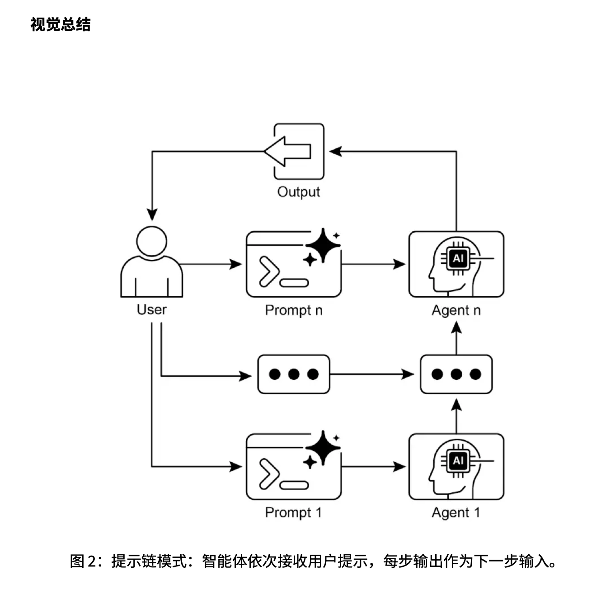

这章讲的是 **提示链（Prompt Chaining）**，也叫 **流水线模式（Pipeline Pattern）**。核心意思很简单：**不要让大语言模型（Large Language Model, LLM）一次性完成复杂任务，而是把任务拆成多个小步骤，让每一步的输出成为下一步的输入。** 

---

## 1. 提示链到底是什么？

比如你要模型完成一个复杂任务：

> 阅读一篇市场调研报告 → 总结主要发现 → 提取趋势和数据 → 写一封邮件给市场团队。

如果你直接写一个大提示：

> 请总结这篇报告，提取趋势，找出数据，并写一封邮件。

模型可能会漏掉某些要求，比如只总结了报告，但没有提取数据；或者写了邮件，但趋势不清楚。

**提示链（Prompt Chaining）** 的做法是把它拆开：

**第 1 步：摘要（Summarization）**
让模型只做一件事：总结报告。

**第 2 步：趋势识别（Trend Identification）**
把第 1 步的摘要交给模型，让它识别趋势和数据。

**第 3 步：邮件生成（Email Generation）**
把第 2 步的趋势和数据交给模型，让它写邮件。

所以它的结构是：

```text
原始输入
  ↓
提示 1：提取/总结
  ↓
中间结果 1
  ↓
提示 2：分析/转换
  ↓
中间结果 2
  ↓
提示 3：生成最终答案
  ↓
最终输出
```

本质上，提示链就是：
**复杂任务 = 多个简单任务按顺序组合。**

---

## 2. 为什么不能直接用一个提示？

PDF 里强调了单一提示的几个问题：

第一，任务太复杂时，模型容易 **忽略部分指令（Instruction Ignoring）**。
你让它同时总结、分析、提取、写作，它可能只认真完成其中一部分。

第二，模型可能 **丢失上下文（Context Loss）**。
复杂任务里有很多信息，模型可能前面读到了，后面生成时忘掉了。

第三，容易出现 **错误累积（Error Accumulation）**。
如果模型一开始理解错了，后面所有内容都可能跟着错。

第四，可能出现 **幻觉（Hallucination）**。
当模型负担太重、信息不清楚时，它更容易编造内容。

所以提示链的价值是：
**降低每一步的认知负担，让模型每次只专注于一个明确的小任务。**

---

## 3. 结构化输出为什么重要？

PDF 里特别提到，提示链的可靠性很依赖每一步之间的数据传递。
如果第 1 步输出很随意，第 2 步就很难稳定处理。

比如第 1 步输出：

```text
趋势大概有 AI 个性化，还有可持续消费，数据也挺明显。
```

这种自然语言对人来说能看懂，但对后续程序或下一步模型来说不够稳定。

更好的方式是要求模型输出 **JSON（JavaScript Object Notation，JavaScript 对象表示法）**：

```json
{
  "trends": [
    {
      "trend_name": "AI 驱动个性化",
      "supporting_data": "73% 消费者更愿意与使用个人信息提升购物体验的品牌合作。"
    },
    {
      "trend_name": "可持续与口碑",
      "supporting_data": "带 ESG 标签产品销量五年增长 28%。"
    }
  ]
}
```

这样下一步就能明确知道：

```text
trend_name 是趋势名称
supporting_data 是支持数据
```

这就是 **结构化输出（Structured Output）** 的作用：
**让每一步的结果更容易被下一步准确使用。**

---

## 4. 提示链常见用在哪里？

几个应用场景，我按重要程度解释。

### 场景一：信息处理流程

比如：

```text
读取文档
  ↓
总结文档
  ↓
提取实体
  ↓
查询数据库
  ↓
生成报告
```

这里的 **实体（Entity）** 指的是人名、地点、日期、公司名、金额等关键信息。

这类流程在 RAG、AI 助手、自动报告生成里很常见。

---

### 场景二：复杂问答

比如用户问：

> 1929 年股市崩盘的主要原因是什么？政府有哪些政策应对？

这个问题其实包含两个子问题：

1. 崩盘原因是什么？
2. 政府政策应对是什么？

提示链会先拆问题，再分别检索，最后综合答案。

```text
问题拆解
  ↓
检索崩盘原因
  ↓
检索政府应对
  ↓
综合生成答案
```

这和 RAG 很相关。
RAG 里面经常不是直接检索一次就回答，而是先拆问题，再多轮检索和整合。

---

### 场景三：数据提取与转换

比如从发票里提取：

```text
姓名
地址
金额
日期
```

模型第一遍可能提取不完整，所以流程可以是：

```text
第一次提取
  ↓
检查字段是否缺失
  ↓
如果缺失，重新提示模型补充
  ↓
再次验证
  ↓
输出结构化数据
```

这里关键点是：
**提示链不一定只是线性走一遍，也可以加入检查、条件分支和重试。**

---

### 场景四：内容生成

比如写一篇文章：

```text
生成主题
  ↓
生成大纲
  ↓
写第一段
  ↓
写第二段
  ↓
整体润色
```

这比直接说“帮我写一篇完整文章”更可控。

因为你可以检查每一步，比如大纲不满意就改大纲，不用等整篇文章都写完再返工。

---

### 场景五：代码生成与优化

比如让 AI 写代码，可以拆成：

```text
理解需求
  ↓
生成伪代码
  ↓
写初版代码
  ↓
检查错误
  ↓
优化代码
  ↓
补充测试
```

这就是为什么很多 Agent 或 Coding Assistant 不会只调用一次模型，而是会经历“规划—生成—检查—修复”的多步流程。

---

## 5. 代码部分在讲什么？

PDF 里的代码用的是 **LangChain Expression Language, LCEL（LangChain 表达式语言）**。

它做了一个两步链：

```text
输入文本
  ↓
第 1 个 prompt：提取技术规格
  ↓
第 1 次 LLM 调用
  ↓
提取结果
  ↓
第 2 个 prompt：转成 JSON
  ↓
第 2 次 LLM 调用
  ↓
最终 JSON
```

代码里的关键部分是：

```python
extraction_chain = prompt_extract | llm | StrOutputParser()
```

意思是：

```text
提示模板
  ↓
语言模型
  ↓
字符串输出解析器
```

然后：

```python
full_chain = (
    {"specifications": extraction_chain}
    | prompt_transform
    | llm
    | StrOutputParser()
)
```

意思是：

把第一条链 `extraction_chain` 的输出，放进变量 `specifications`，再传给第二个提示。

所以这里的核心不是代码本身，而是它展示了一个很重要的思想：

> 模型的一次输出，可以被包装成下一次模型调用的输入。

这就是提示链。

---

## 6. 上下文工程和提示工程的区别

讲了 **上下文工程（Context Engineering）** 和 **提示工程（Prompt Engineering）** 的区别。

**提示工程（Prompt Engineering）** 更关注：
我怎么把这句话问得更好？

比如：

```text
请你作为一名资深数据分析师，分析下面这份用户行为数据。
```

而 **上下文工程（Context Engineering）** 关注的是：
在模型回答之前，我应该给它哪些信息？

这些信息可能包括：

```text
系统提示 System Prompt
用户历史 User History
检索文档 Retrieved Documents
工具输出 Tool Outputs
数据库查询结果 Database Results
当前环境状态 Environment State
记忆 Memory
```

所以可以这样理解：

```text
提示工程：优化“怎么问”
上下文工程：优化“模型回答前知道什么”
```

上下文工程的范围更大。
RAG、记忆、工具调用、用户历史、结构化输出，都可以看成上下文工程的一部分。

PDF 第 7 页的图也在表达这个意思：**Context Engineering 是一个更大的集合，里面包含 Prompt Engineering、RAG、Memory、State/History、Structured Outputs 等模块。** 

---

## 7. 第 8 页图在表达什么？

第 8 页的图是提示链的视觉总结。它表达的是：

```text
User
 ↓
Prompt 1 → Agent 1 → 中间输出
 ↓
Prompt n → Agent n → 最终输出
```

重点是：
**不是一个 Agent 一次性解决所有问题，而是多个步骤依次执行，每一步的输出都影响下一步。** 

这里的 **Agent（智能体）** 不一定指真正复杂的自主智能体，也可以简单理解为：

```text
一次 LLM 调用 + 一个明确任务
```

比如：

```text
Agent 1：负责提取信息
Agent 2：负责整理成 JSON
Agent 3：负责生成最终回答
```

---

## 8. 师生对话版理解

**学生：老师，提示链是不是就是多问几次模型？**

不是简单地多问几次，而是每一次都有明确分工。
第 1 次负责提取，第 2 次负责转换，第 3 次负责生成。它们之间有输入输出关系。

---

**学生：那它和普通聊天有什么区别？**

普通聊天里，你可能想到什么问什么。
提示链里，每一步是提前设计好的流程。

比如：

```text
extract → validate → transform → generate
```

这更像一个可控程序，而不是随便聊天。

---

**学生：为什么它能提升准确性？**

因为模型每一步只处理一个小任务。
让模型一次性完成 5 件事，出错概率高；让它每次只完成 1 件事，结果更稳定。

---

**学生：那提示链是不是一定比单提示好？**

不一定。
如果任务本身很简单，比如“把这句话翻译成英文”，单提示就够了。
提示链适合复杂任务，比如多步推理、文档处理、数据提取、工具调用、Agent 流程。

---

**学生：提示链和 Agent 有什么关系？**

提示链是 Agent 的基础能力之一。
因为 Agent 往往要：

```text
理解任务
  ↓
制定计划
  ↓
调用工具
  ↓
观察结果
  ↓
继续推理
  ↓
生成答案
```

这天然就是多步链式流程。

---

## 9. 直观总结

这章你需要掌握的核心就三句话：

**第一，提示链（Prompt Chaining）是把复杂任务拆成多个小任务。**

**第二，每一步的输出会作为下一步的输入，所以它是一个顺序流程。**

**第三，它让 LLM 系统更可靠、更可控，是 RAG、Agent、工具调用、多步推理系统的基础模式。**

最重要的理解是：

```text
单提示：让模型一次性完成整个复杂任务。
提示链：让模型一步一步完成，每一步都有明确职责。
```

你现在学 Agent 和 RAG，这章是基础，但不需要死抠代码。你真正要记住的是这种工程思路：

```text
拆任务
定步骤
规范中间输出
逐步传递
必要时检查和重试
```

这就是提示链的本质。



## 推荐阅读

下一篇：

> [路由（Routing）](/p/路由routing/)

