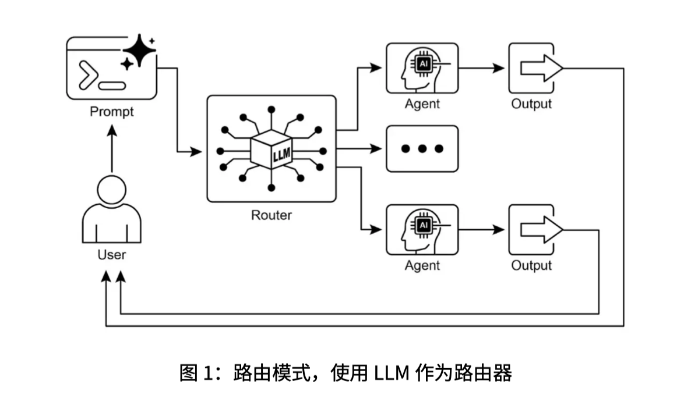

这章讲的是 **路由（Routing）**。它和上一章 **提示链（Prompt Chaining）** 是一组很重要的对照。

上一章的提示链是：

```text
步骤 1 → 步骤 2 → 步骤 3 → 最终输出
```

它的路线是固定的。

而这一章的 **路由（Routing）** 是：

```text
先判断当前输入属于哪一类
然后选择不同的处理路径
```

也就是说，路由让智能体不再只会“按固定流程往下走”，而是能根据用户输入、当前状态、前一步结果，动态决定下一步该做什么。

---

## 1. 路由到底是什么？

**路由（Routing）** 的本质是：

> 根据条件，把任务分发到合适的工具、函数、子流程或子智能体。

比如一个客服智能体收到用户问题：

```text
我想查一下我的订单到哪里了。
```

系统应该把它送到：

```text
订单查询工具 / 订单数据库
```

如果用户说：

```text
这款手机有哪些颜色？
```

系统应该把它送到：

```text
产品信息检索工具
```

如果用户说：

```text
我的设备一直打不开，怎么办？
```

系统应该把它送到：

```text
技术支持流程
```

如果用户说：

```text
帮我看看那个东西。
```

这太模糊，系统应该进入：

```text
澄清问题流程
```

所以路由解决的是一个问题：

```text
当前任务应该交给谁处理？
```

---

## 2. 路由和提示链的区别

可以这样对比：

| 模式  | 英文              | 核心特点     |
| --- | --------------- | -------- |
| 提示链 | Prompt Chaining | 固定顺序执行   |
| 路由  | Routing         | 根据条件选择路径 |

提示链像这样：

```text
输入
 ↓
摘要
 ↓
提取实体
 ↓
生成报告
```

路由像这样：

```text
输入
 ↓
判断意图
 ↓
如果是订单问题 → 查订单
如果是产品问题 → 查产品库
如果是技术问题 → 技术支持
如果不明确 → 追问用户
```

所以提示链强调 **顺序处理（Sequential Processing）**，路由强调 **条件分支（Conditional Branching）**。

这章最关键的理解就是：

> 提示链解决“怎么一步一步做”，路由解决“下一步该走哪条路”。

---

## 3. 为什么 Agent 需要路由？

真实的 **智能体系统（Agent System）** 不可能永远按一个固定流程处理所有问题。

比如一个 AI 助手可能同时具备这些能力：

```text
查天气
查日程
写邮件
分析文档
写代码
查数据库
调用搜索
```

用户一发消息，系统首先要判断：

```text
这个请求应该调用哪个能力？
```

例如：

```text
明天下午我有空吗？
```

应该路由到：

```text
日历工具 Calendar Tool
```

用户说：

```text
帮我总结。
```

应该路由到：

```text
文档解析流程 Document Processing Pipeline
```

用户说：

```text
帮我写一个 SQL 查询。
```

应该路由到：

```text
代码生成 / SQL 助手
```

所以路由是 Agent 从“线性执行器”变成“动态决策系统”的关键。PDF 里也说，路由让系统从固定执行路径，变成可以根据上下文选择后续动作的模式。

---

## 4. 路由有哪些实现方式？

四种主要路由方式。

### 方式一：基于 LLM 的路由

中文：**基于大语言模型的路由**
英文：**LLM-based Routing**

意思是：让模型先判断用户意图，然后输出一个类别。

比如提示模型：

```text
请判断下面用户请求属于哪一类：
订单状态、产品信息、技术支持、其他。
只输出类别。
```

用户输入：

```text
我的订单什么时候到？
```

模型输出：

```text
订单状态
```

然后程序根据这个结果，把请求送到订单查询流程。

这种方式灵活，能理解自然语言，但缺点是可能不稳定。
所以实际工程里经常要求它输出固定标签，比如：

```text
booker
info
unclear
```

而不是输出一大段解释。

---

### 方式二：基于嵌入的路由

中文：**基于嵌入的路由**
英文：**Embedding-based Routing**

这个和你之前学的 **嵌入（Embedding）**、**向量检索（Vector Retrieval）** 有关系。

做法是：

```text
把用户问题转成向量
 ↓
把每个路由能力也转成向量
 ↓
比较相似度
 ↓
选择最相似的路径
```

比如系统里有三个能力：

```text
订单查询
产品咨询
技术支持
```

每个能力都有一段描述，也可以转成向量。

用户问：

```text
为什么我的耳机连不上蓝牙？
```

它和“技术支持”的语义最接近，所以路由到技术支持流程。

这种方式适合 **语义路由（Semantic Routing）**。
也就是不是靠关键词，而是靠意思。

---

### 方式三：基于规则的路由

中文：**基于规则的路由**
英文：**Rule-based Routing**

这就是写代码判断：

```python
if "订单" in user_query:
    route = "order"
elif "退款" in user_query:
    route = "refund"
else:
    route = "general"
```

优点是快、稳定、可控。

缺点是死板。
如果用户没有说“订单”，而是说：

```text
我买的东西怎么还没到？
```

规则可能识别不到，但 LLM 或 embedding 可能能理解这是订单状态问题。

---

### 方式四：基于机器学习模型的路由

中文：**基于机器学习模型的路由**
英文：**Machine-learning-based Routing**

这里可以训练一个分类模型，比如：

```text
输入：用户问题
输出：类别
```

类别可能是：

```text
订单
退款
产品咨询
技术支持
其他
```

它和 LLM 路由的区别是：

LLM 路由是在推理时用提示词让模型判断；
机器学习路由是提前用标注数据训练一个专门的分类器。

这种方式适合请求量大、类别稳定、对成本和速度要求高的系统。

---

## 5. 代码部分在讲什么？

PDF 里有两个代码例子：一个是 **LangChain**，一个是 **Google ADK**。

你现在不需要死抠每一行代码，重点理解架构。

---

## 6. LangChain 示例的核心逻辑

代码里定义了三个处理器：

```python
booking_handler()
info_handler()
unclear_handler()
```

它们分别负责：

```text
booking_handler：处理预订请求
info_handler：处理信息查询
unclear_handler：处理不明确请求
```

然后有一个 **协调者路由链（Coordinator Router Chain）**：

```python
coordinator_router_chain = coordinator_router_prompt | llm | StrOutputParser()
```

它负责判断用户请求属于哪一类。

提示词要求模型只输出三个词之一：

```text
booker
info
unclear
```

然后用：

```python
RunnableBranch
```

根据模型输出选择不同分支。

整体流程是：

```text
用户请求
 ↓
LLM 判断类别
 ↓
如果是 booker → booking_handler
如果是 info → info_handler
否则 → unclear_handler
 ↓
输出结果
```

所以这段代码演示的是：

> 用 LLM 当路由器，再用程序分支把请求分发给不同函数。

这里的 **路由器（Router）** 就是负责判断“该走哪条路”的组件。

---

## 7. Google ADK 示例在讲什么？

**Google ADK（Agent Development Kit，智能体开发工具包）** 的风格和 LangChain 不太一样。

LangChain 示例里，你显式写了：

```text
如果 decision == booker，就调用 booking_handler
如果 decision == info，就调用 info_handler
```

而 Google ADK 更像是你先定义好几个子智能体：

```text
Booker：负责预订
Info：负责信息查询
Coordinator：负责协调
```

然后在 Coordinator 里写指令：

```text
涉及机票或酒店预订的请求，委托给 Booker。
其他一般信息问题，委托给 Info。
```

也就是：

```text
用户请求
 ↓
Coordinator 分析
 ↓
委托给 Booker 或 Info
 ↓
子智能体调用对应工具
 ↓
返回结果
```

PDF 里说，ADK 的 **Auto-Flow（自动流程）** 会根据 `sub_agents` 自动完成委托。

所以 LangChain 更像是你自己写清楚分支逻辑；
ADK 更像是你定义能力和子智能体，然后让框架帮你做委托。

---

## 8. 第 9 页图怎么理解？

第 9 页的图是这章的视觉总结。

图里大概是：

```text
User
 ↓
Prompt
 ↓
Router
 ↙   ↓   ↘
Agent 1 / 中间流程 / Agent 2
 ↓             ↓
Output       Output
```

它表达的是：

> 用户请求先进入 Router，Router 判断以后，把请求送到不同 Agent 或流程里。

这个图和上一章提示链的图很不一样。

上一章是：

```text
一步接一步
```

这一章是：

```text
先判断，再分流
```

所以你可以把第 9 页的图理解成一个智能体系统里的“分发中心”。

---

## 9. 师生对话版理解

**学生：老师，路由是不是就是分类？**

很接近，但不完全一样。

分类只是判断类别，比如：

```text
这是订单问题。
```

路由还要根据类别决定动作：

```text
这是订单问题，所以交给订单查询工具。
```

所以：

```text
分类 Classification：判断它是什么
路由 Routing：判断完以后，把它送到哪里
```

---

**学生：那路由是不是 Agent 里的 if-else？**

可以这么理解，但它比普通 if-else 更灵活。

最简单的路由就是：

```python
if 条件:
    走 A 流程
else:
    走 B 流程
```

但 Agent 里的条件可能不是简单关键词，而是用户意图、语义相似度、任务状态、工具返回结果等。

所以路由可以由：

```text
规则 Rule
LLM 判断
Embedding 相似度
分类模型 Classifier
```

共同实现。

---

**学生：为什么不直接让一个大模型全都处理？**

因为真实系统里，很多事情不能只靠模型生成文本。

比如查订单需要数据库，订酒店需要外部 API，查日程需要 Calendar，处理代码可能需要执行器。

模型应该先判断：

```text
我现在该调用哪个工具？
```

而不是假装自己知道所有答案。

路由就是让系统知道：

```text
这个问题该交给哪个能力模块处理。
```

---

**学生：路由和工具调用有什么关系？**

关系很近。

**工具调用（Tool Calling）** 本身就包含路由思想。

因为模型看到用户请求以后，要决定：

```text
要不要调用工具？
调用哪个工具？
传什么参数？
```

这其实就是一种路由。

例如：

```text
用户：帮我查明天台北天气
```

系统应该路由到：

```text
weather_tool
```

而不是直接编一个天气答案。

---

## 10. 这章你需要掌握什么？

最重要的是这几个关键词：

| 中文   | English            | 含义              |
| ---- | ------------------ | --------------- |
| 路由   | Routing            | 根据条件选择下一步流程     |
| 路由器  | Router             | 负责判断该走哪条路径的组件   |
| 条件逻辑 | Conditional Logic  | 根据条件分支执行        |
| 子智能体 | Sub-agent          | 专门负责某类任务的智能体    |
| 工具   | Tool               | 可被智能体调用的外部能力    |
| 委托   | Delegation         | 把任务交给合适的子智能体或工具 |
| 意图识别 | Intent Recognition | 判断用户到底想做什么      |
| 语义路由 | Semantic Routing   | 根据语义相似度选择路径     |

---

## 11. 直观总结

这章一句话总结：

> 路由（Routing）就是让 Agent 根据用户输入或当前状态，选择最合适的工具、函数、流程或子智能体。

和上一章连起来看：

```text
提示链 Prompt Chaining：
把复杂任务拆成固定顺序的小步骤。

路由 Routing：
在多个可能步骤之间，根据条件选择一条路。
```

真正的 Agent 往往两者都会用：

```text
用户输入
 ↓
路由：判断任务类型
 ↓
选择某条流程
 ↓
提示链：在这条流程里一步一步处理
 ↓
必要时再路由到工具或子智能体
 ↓
最终输出
```

所以你可以这样记：

```text
提示链 = 顺序执行能力
路由 = 分支决策能力
```

Agent 要变得有用，不能只会顺序执行，还必须会根据情况选路。



## 推荐阅读

上一篇：

> [提示链（Prompt Chaining）](../01-prompt-chaining/)

下一篇：

> [并行化（Parallelization）](../03-parallelization/)

