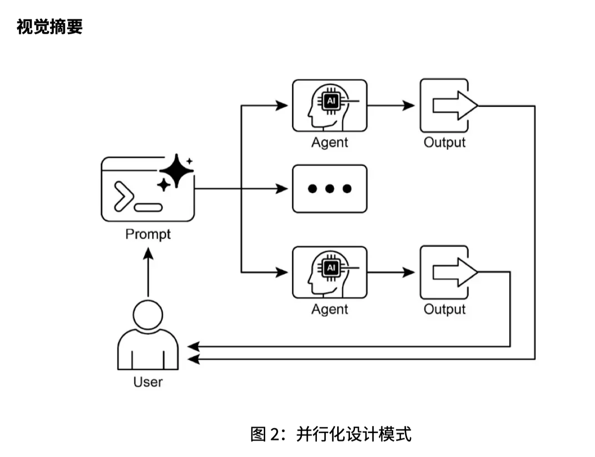

这章讲的是 **并行化（Parallelization）**。它是在前两章基础上继续扩展：

```text
提示链 Prompt Chaining：一步接一步做
路由 Routing：根据条件选择走哪条路
并行化 Parallelization：多个互不依赖的任务同时做
```

这章的核心问题是：

> 有些任务不需要按顺序等，可以同时执行。并行化就是把这些可以同时做的部分拆出来，一起跑，最后再汇总结果。

---

## 1. 并行化到底是什么？

**并行化（Parallelization）** 指的是：
在一个智能体工作流里，让多个 **LLM 调用（LLM Calls）**、工具调用、API 请求、数据库查询、子智能体任务同时执行。

比如一个研究智能体要调查一个主题，串行做法是：

```text
搜索来源 A
 ↓
总结来源 A
 ↓
搜索来源 B
 ↓
总结来源 B
 ↓
综合 A 和 B 的结果
```

这样的问题是：
你必须等 A 做完，才开始 B。总耗时大概是所有步骤时间相加。

并行做法是：

```text
同时搜索来源 A 和来源 B
 ↓
同时总结来源 A 和来源 B
 ↓
综合两个摘要
```

也就是：

```text
A 路线：搜索 A → 总结 A
B 路线：搜索 B → 总结 B

A 和 B 同时跑
最后汇总
```

所以并行化的本质是：

> 找出彼此没有依赖关系的任务，让它们同时执行。

---

## 2. 什么叫“没有依赖关系”？

这是理解并行化最关键的点。

如果任务 B 必须用到任务 A 的结果，那么它们不能并行。

比如：

```text
先读取文档
再总结文档
```

这里总结必须依赖读取结果，所以不能同时做。

但是下面这些可以并行：

```text
同时查新闻
同时查股票数据
同时查社交媒体
同时查公司数据库
```

因为它们彼此之间不需要等待对方结果。

你可以这样判断：

```text
如果任务 B 不需要任务 A 的输出，那么 A 和 B 可能可以并行。
如果任务 B 需要任务 A 的输出，那么它们只能串行。
```

---

## 3. 并行化为什么重要？

因为很多 Agent 任务的慢，不是模型真的“思考”很久，而是在等外部服务。

比如：

```text
等待搜索 API 返回
等待数据库查询
等待网页加载
等待多个 LLM 请求完成
等待文件解析
```

如果你一个个等，总时间会很长。

例如三个任务分别花：

```text
任务 A：5 秒
任务 B：6 秒
任务 C：4 秒
```

串行执行大概需要：

```text
5 + 6 + 4 = 15 秒
```

并行执行大概接近：

```text
max(5, 6, 4) = 6 秒
```

当然真实情况还会有调度开销，但整体通常会快很多。

所以 PDF 里说，并行化尤其适合外部资源调用，比如 API、数据库、搜索工具等，因为这些场景有明显等待时间。

---

## 4. 第 2 页图怎么理解？

第 2 页的图展示的是：

```text
Input
 ↓
Parallel Agent
 ↙      ↓      ↘
Sub Agent 1  Sub Agent 2  Sub Agent 3
 ↓           ↓           ↓
Output 1    Output 2    Output 3
```

也就是说，一个输入进来之后，不是只交给一个智能体处理，而是同时交给多个 **子智能体（Sub-agents）**。

比如输入是：

```text
帮我调研新能源行业的发展趋势。
```

系统可以同时派出三个子智能体：

```text
Sub Agent 1：查可再生能源
Sub Agent 2：查电动汽车
Sub Agent 3：查碳捕集
```

这三个任务互不依赖，所以可以同时跑。最后再把它们的输出合并成一份报告。第 2 页的图就是这个结构。

---

## 5. 并行化适合哪些场景？

PDF 给了很多应用场景，我帮你按 Agent 项目里最常见的场景整理。

### 场景一：信息收集与调研

比如调研一家公司：

```text
同时查新闻
同时查股票数据
同时查社交媒体
同时查公司数据库
```

这些任务互不依赖，所以适合并行。

最后再让一个模型综合：

```text
新闻结果 + 股票结果 + 社媒结果 + 公司数据库结果
 ↓
生成公司调研报告
```

这在研究型 Agent 里非常常见。

---

### 场景二：数据处理与分析

比如分析客户反馈，可以同时做：

```text
情感分析 Sentiment Analysis
关键词提取 Keyword Extraction
主题分类 Topic Classification
紧急问题识别 Urgency Detection
```

每个任务都是从同一批文本出发，但分析角度不同。

所以可以同时跑，最后汇总成：

```text
这批反馈整体情绪偏负面；
高频关键词是退款、物流、客服；
主要类别是售后问题；
其中 12 条需要优先处理。
```

---

### 场景三：多个 API 或工具调用

比如旅行规划 Agent：

```text
同时查机票
同时查酒店
同时查当地活动
同时查餐厅推荐
```

这些调用没有严格先后关系，所以适合并行。

等结果都回来后，再统一生成旅行方案。

---

### 场景四：内容生成

比如生成一封营销邮件，可以同时生成：

```text
标题 Subject
正文 Body
图片提示词 Image Prompt
行动按钮文案 CTA Copy
```

这里的 **CTA（Call To Action，行动号召）** 指的是按钮或结尾引导语，比如“立即预约”“查看详情”。

最后再合并成完整邮件。

---

### 场景五：验证与校验

比如用户提交注册信息，系统可以同时检查：

```text
邮箱格式
手机号格式
地址有效性
敏感词
黑名单
```

这些校验互不依赖，所以并行可以加快响应速度。

---

### 场景六：多方案生成

比如让模型生成三个标题：

```text
标题版本 A
标题版本 B
标题版本 C
```

可以同时让不同 prompt 或不同模型生成，然后再比较选择最好的。

这就是 **多方案生成（Multi-candidate Generation）**，也可以服务于 **A/B 测试（A/B Testing）**。

---

## 6. LangChain 代码在讲什么？

PDF 里的 LangChain 示例做了一个很典型的并行流程。

它对同一个主题，同时做三件事：

```text
1. 总结主题
2. 生成相关问题
3. 提取关键词
```

代码里对应三个链：

```python
summarize_chain
questions_chain
terms_chain
```

分别是：

```text
summarize_chain：生成摘要
questions_chain：生成三个问题
terms_chain：提取 5-10 个关键词
```

然后关键是这个：

```python
map_chain = RunnableParallel(
    {
        "summary": summarize_chain,
        "questions": questions_chain,
        "key_terms": terms_chain,
        "topic": RunnablePassthrough(),
    }
)
```

这里的 **RunnableParallel** 就是 LangChain 里用于并行运行多个 Runnable 的关键组件。

它的意思是：

```text
对同一个 topic，同时运行：
- summary
- questions
- key_terms
同时保留原始 topic
```

然后等这些结果都完成后，再进入汇总 prompt：

```text
摘要：{summary}
相关问题：{questions}
关键词：{key_terms}
原始主题：{topic}

请综合生成完整答案。
```

整体流程是：

```text
topic
 ↓
并行执行：
   ├─ 摘要生成
   ├─ 问题生成
   └─ 关键词提取
 ↓
汇总 prompt
 ↓
LLM 生成最终答案
```

所以这段代码不是让你重点记 API，而是让你理解一个结构：

> 先 map：并行处理多个子任务；再 reduce/synthesis：汇总结果。

---

## 7. asyncio 是什么？这里要注意什么？

 `asyncio`，这个点你要知道。

**asyncio** 是 Python 里的 **异步 I/O（Asynchronous I/O）** 框架。

它常用于：

```text
网络请求
API 调用
数据库请求
文件 I/O
多个 LLM 请求
```

PDF 里特别提醒：`asyncio` 提供的是 **并发（Concurrency）**，不一定是真正的 **并行（Parallelism）**。

这两个词要区分：

| 中文 | English     | 含义               |
| -- | ----------- | ---------------- |
| 并发 | Concurrency | 多个任务交替推进，看起来同时进行 |
| 并行 | Parallelism | 多个任务真的在同一时刻运行    |

在 Python 里，`asyncio` 通常是在一个线程里运行。
当任务 A 在等网络返回时，事件循环可以切换去推进任务 B。

所以对于 LLM API 调用、搜索 API、数据库请求这类任务，`asyncio` 很有用，因为这些任务大量时间都在“等待”。

但是如果是大量 CPU 计算，比如矩阵乘法、大规模图像处理，`asyncio` 不一定能解决，需要多进程、GPU 或底层并行计算。

---

## 8. Google ADK 代码在讲什么？

PDF 后面讲了 Google ADK 的例子。

它定义了三个调研智能体：

```text
RenewableEnergyResearcher：调研可再生能源
EVResearcher：调研电动汽车
CarbonCaptureResearcher：调研碳捕集
```

每个智能体都用 Google Search 工具去查信息，然后把结果存到不同的 `output_key`：

```text
renewable_energy_result
ev_technology_result
carbon_capture_result
```

然后用：

```python
ParallelAgent
```

把三个调研智能体并行运行。

流程是：

```text
ParallelAgent
 ├─ RenewableEnergyResearcher
 ├─ EVResearcher
 └─ CarbonCaptureResearcher
```

等三个结果都出来后，再交给：

```python
SynthesisAgent
```

进行整合。

最后外层是：

```python
SequentialAgent(
    sub_agents=[parallel_research_agent, merger_agent]
)
```

这说明整个流程其实是：

```text
第一阶段：并行调研
第二阶段：串行汇总
```

也就是：

```text
并行 + 串行 组合使用
```

这点非常重要。真实 Agent 不是只用一种模式，而是混合使用：

```text
先路由
再并行
再汇总
再继续提示链
```

---

## 9. 第 9 页图怎么理解？

第 9 页的图是并行化模式的视觉摘要。

它表达的是：

```text
User
 ↓
Prompt
 ↓
分成多条路径
 ↙        ↘
Agent 1   Agent 2
 ↓        ↓
Output 1 Output 2
 ↘        ↙
返回给用户 / 汇总
```

核心含义是：

> 一个任务可以拆成多个独立子任务，多个 Agent 同时处理，最后把结果收回来。

这个图和前两章连起来看：

提示链图：

```text
一条线往下走
```

路由图：

```text
先判断，然后选择一条路
```

并行图：

```text
同时走多条路，最后汇总
```

---

## 10. 师生对话版理解

**学生：老师，并行化是不是就是多个任务一起做？**

对，但前提是这些任务之间没有依赖关系。

比如“查机票”和“查酒店”可以同时做。
但“先读取文档，再总结文档”不能同时做，因为总结需要读取结果。

---

**学生：那并行化是不是一定会提升效果？**

不一定。它主要提升的是效率，也就是减少等待时间。

但它会增加系统复杂度，比如：

```text
错误处理更复杂
日志更复杂
结果汇总更复杂
并发数量需要控制
多个工具可能同时失败
```

PDF 里也提到，并发/并行架构会增加设计、调试和日志成本。

---

**学生：那什么时候没必要并行？**

如果任务很简单，或者步骤之间有强依赖，就没必要并行。

比如：

```text
用户问：什么是线性回归？
```

直接回答就行，不需要开三个 Agent。

并行化适合复杂任务，尤其是：

```text
多来源检索
多 API 调用
多文档处理
多角度分析
多方案生成
```

---

**学生：并行和路由有什么区别？**

路由是选择一条路：

```text
A / B / C 里选一个
```

并行是多条路一起跑：

```text
A、B、C 同时执行
```

所以：

```text
Routing = choose one or some paths
Parallelization = run multiple independent paths together
```

---

**学生：并行和提示链有什么关系？**

提示链强调顺序：

```text
步骤 1 → 步骤 2 → 步骤 3
```

并行强调同时：

```text
步骤 A
步骤 B
步骤 C
同时执行
```

但真实系统常常结合：

```text
先并行收集信息
再串行汇总结果
再继续下一步处理
```

例如：

```text
并行检索多个资料源
 ↓
汇总成报告
 ↓
检查报告质量
 ↓
输出最终答案
```

---

## 11. 这章关键词

| 中文               | English                 | 含义                             |
| ---------------- | ----------------------- | ------------------------------ |
| 并行化              | Parallelization         | 同时执行多个独立任务                     |
| 并发               | Concurrency             | 多任务交替推进，常用于 I/O 等待             |
| 并行               | Parallelism             | 多任务真正同时运行                      |
| 异步               | Asynchronous            | 不阻塞等待，允许任务切换                   |
| 异步 I/O           | Asynchronous I/O        | 网络、API、数据库等等待型任务的异步处理          |
| 子智能体             | Sub-agent               | 负责某个子任务的智能体                    |
| 汇总               | Synthesis / Aggregation | 把多个并行结果整合起来                    |
| RunnableParallel | RunnableParallel        | LangChain 中并行运行多个 Runnable 的组件 |
| ParallelAgent    | ParallelAgent           | Google ADK 中并行运行多个智能体的组件       |
| SequentialAgent  | SequentialAgent         | Google ADK 中按顺序运行智能体的组件        |

---

## 12. 直观总结

这章最重要的结论是：

> 并行化（Parallelization）就是把互不依赖的子任务同时执行，从而降低整体延迟，提高 Agent 系统响应速度。

和前两章合起来：

```text
提示链 Prompt Chaining：
适合有先后依赖的多步任务。

路由 Routing：
适合根据条件选择不同路径。

并行化 Parallelization：
适合多个互不依赖的任务同时执行。
```

真正的 Agent 工作流通常是三者混合：

```text
用户输入
 ↓
路由：判断任务类型
 ↓
并行：同时调用多个工具或子智能体
 ↓
汇总：整合多个结果
 ↓
提示链：继续后续处理
 ↓
最终输出
```

你学这章时不用死抠代码，重点记住这个工程判断：

```text
能不能并行，看任务之间有没有依赖。
没有依赖，可以并行。
有依赖，必须串行。
```

这一章本质是在讲：
**Agent 不只是要会做事，还要做得快。**



## 推荐阅读

上一篇：

> [路由](../02-routing/)

下一篇：

> [反思](../04-reflection/)

