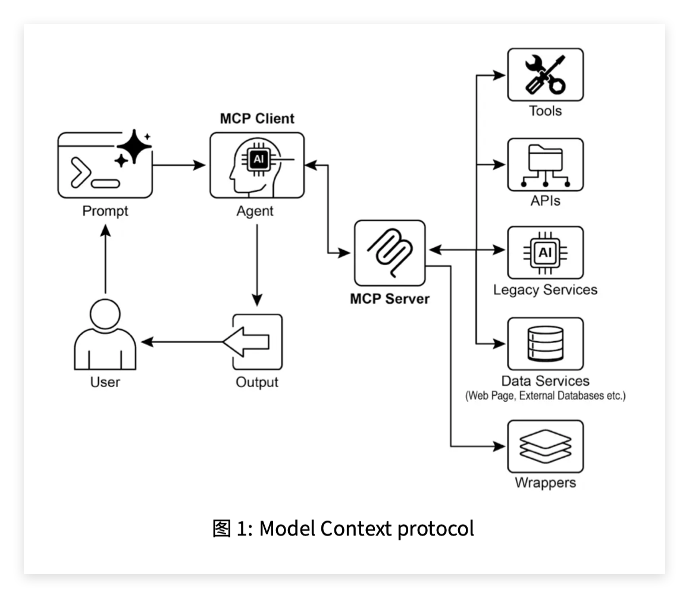

这一章讲的是 **模型上下文协议（Model Context Protocol，MCP）**。它和前面的 **工具调用（Tool Calling）** 很像，但抽象层级更高。

核心一句话：

> **MCP 是一种开放标准，用来规范 LLM / Agent 如何连接外部工具、数据源、API、文件系统和业务系统。它不是某一个工具，而是一套“连接外部世界”的标准协议。** 

---

## 1. 为什么需要 MCP？

前面我们已经讲过：Agent 要真正有用，不能只会生成文本，还要能：

```text
查数据库
读文件
调用 API
发邮件
查 CRM
生成图片/视频/语音
控制设备
操作业务系统
```

如果没有统一标准，每接一个系统都要单独写一套适配逻辑：

```text
OpenAI 接数据库：写一套
Claude 接数据库：再写一套
Gemini 接数据库：再写一套

OpenAI 接文件系统：写一套
Claude 接文件系统：再写一套
Gemini 接文件系统：再写一套
```

这就非常混乱。

MCP 要解决的问题就是：

> 不要让每个模型和每个工具都单独集成，而是规定一个标准接口，让 Agent 可以用统一方式发现、连接和调用外部能力。

所以 MCP 的价值是：

```text
标准化 Standardization
可复用 Reusability
可组合 Composability
可扩展 Scalability
互操作 Interoperability
```

---

## 2. MCP 到底是什么？

**MCP（Model Context Protocol，模型上下文协议）** 是一个开放协议。

它规定了：

```text
LLM 应用如何发现外部能力
LLM 应用如何调用外部工具
外部系统如何暴露数据资源
外部系统如何提供 Prompt 模板
外部系统如何把执行结果返回给 Agent
```

它采用的是 **客户端-服务器架构（Client-Server Architecture）**。

简单结构是：

```text
LLM / Agent 应用
        ↓
MCP Client
        ↓
MCP Server
        ↓
外部工具 / 数据库 / API / 文件系统 / SaaS 系统
```

这里有两个核心角色：

### MCP 客户端（MCP Client）

通常在 LLM 应用或 Agent 框架里。

它负责：

```text
连接 MCP Server
发现可用工具、资源、Prompt
把 LLM 的意图转换成 MCP 请求
把 MCP Server 返回的结果交回 LLM
```

### MCP 服务器（MCP Server）

它负责把外部能力暴露出来。

比如一个文件系统 MCP Server 可以暴露：

```text
列出文件 list_directory
读取文件 read_file
写入文件 write_file
```

一个数据库 MCP Server 可以暴露：

```text
查询表
过滤数据
排序数据
更新记录
```

PDF 里说，MCP Server 负责暴露数据资源、Prompt 和可执行工具，而 MCP Client 负责消费这些能力。

---

## 3. MCP 暴露的三类东西：资源、工具、Prompt

这一章有一个关键区分：

```text
资源 Resource
工具 Tool
Prompt
```

### 资源（Resource）

资源是可读取的数据。

比如：

```text
PDF 文件
Markdown 文档
数据库记录
网页内容
知识库条目
图片元数据
```

资源本身不一定执行动作，它主要是“被读取”。

---

### 工具（Tool）

工具是可执行功能。

比如：

```text
发送邮件
查询库存
创建订单
写入文件
调用天气 API
生成图片
运行 SQL
```

工具会产生动作或结果。

---

### Prompt

Prompt 是交互模板，用来指导 LLM 怎么使用资源或工具。

比如：

```text
请根据以下数据库字段生成 SQL 查询
请根据以下文档内容回答用户问题
请按固定格式生成报告
```

所以 MCP Server 不只是暴露函数，也可以暴露上下文资源和提示模板。

---

## 4. MCP 和工具函数调用有什么区别？

这是这一章最重要的部分。

### 工具函数调用（Tool / Function Calling）

它是某个 LLM 应用直接定义一组工具，然后模型调用这些工具。

结构通常是：

```text
LLM
↓
某个预定义函数
↓
应用代码执行函数
↓
返回结果
```

比如：

```python
get_weather(location: str)
```

这种方式适合简单固定场景。

但问题是：不同模型厂商的工具调用格式可能不一样，而且工具和应用强绑定。

---

### MCP

MCP 是标准协议。

它的目标不是“给某个模型写几个函数”，而是：

```text
让任何符合 MCP 的客户端，都能连接任何符合 MCP 的服务器。
```

也就是说，一个 MCP Server 可以被多个 Agent、多个模型、多个应用复用。

PDF 里用表格对比了二者：工具函数调用通常是厂商定制、直接请求预定义函数；MCP 是开放标准，支持动态发现、客户端-服务器架构和可复用服务。

可以这样总结：

| 对比项  | 工具函数调用                  | MCP                    |
| ---- | ----------------------- | ---------------------- |
| 中文   | 工具/函数调用                 | 模型上下文协议                |
| 英文   | Tool / Function Calling | Model Context Protocol |
| 抽象层级 | 低一些                     | 高一些                    |
| 连接方式 | 模型直接调用预定义工具             | 客户端连接 MCP Server       |
| 标准化  | 多为厂商定制                  | 开放标准                   |
| 工具发现 | 通常需要提前写死                | 支持动态发现                 |
| 复用性  | 较弱                      | 较强                     |
| 适合场景 | 少量固定工具                  | 复杂、企业级、多系统集成           |

最直接的理解是：

> **工具调用是“我给这个 Agent 配几个工具”；MCP 是“我搭一个标准工具服务器，让不同 Agent 都能来用”。**

---

## 5. MCP 不是万能的：底层 API 仍然要设计好

这一章有一个很现实的提醒：MCP 只是接口标准，不会神奇地让烂 API 变好。

比如一个工单系统 API 只能：

```text
一次获取一个工单详情
```

如果 Agent 想汇总所有高优先级工单，它就要一个个查，非常慢，也容易出错。

更好的 API 应该支持：

```text
按优先级过滤
按时间排序
批量查询
分页返回
结构化字段
```

所以 MCP Server 设计时，要考虑 Agent 是否真的容易使用。

PDF 也说，如果只是简单把传统 API 包装成 MCP 接口，而不优化底层 API，智能体表现可能很差；底层 API 应支持过滤、排序等确定性能力。

这点很重要：

> **Agent 不应该替代所有确定性流程。能用精确过滤、排序、查询解决的问题，应该让底层工具直接支持，而不是让 LLM 自己猜。**

---

## 6. 数据格式也很重要

PDF 还举了一个例子：如果文档 API 只返回 PDF 文件，Agent 不一定能直接理解。

更好的做法是让 API 返回：

```text
纯文本 Text
Markdown
结构化 JSON
分段后的文档块
带元数据的内容
```

也就是说，MCP Server 不只是“能连上”，还要返回 Agent 能处理的数据。

这对 RAG 和企业知识库尤其重要。

比如：

```text
差的 MCP 资源：返回一个 PDF 二进制文件
好的 MCP 资源：返回 Markdown 文本 + 标题 + 页码 + 来源链接
```

这样 Agent 才能真正使用它。

---

## 7. MCP 的标准交互流程

PDF 里给了 MCP 的交互流程。

可以拆成 5 步：

### 第一步：发现（Discovery）

MCP Client 查询 MCP Server：

```text
你有哪些工具？
你有哪些资源？
你有哪些 Prompt？
```

Server 返回能力清单。

---

### 第二步：请求构造（Request Construction）

LLM 判断需要调用某个工具。

比如用户说：

```text
帮我给 John 发一封邮件
```

LLM 决定调用：

```text
send_email
```

并构造参数：

```json
{
  "to": "John",
  "subject": "Meeting",
  "body": "..."
}
```

---

### 第三步：客户端通信（Client Communication）

MCP Client 把请求按标准格式发送给 MCP Server。

---

### 第四步：服务器执行（Server Execution）

MCP Server 做几件事：

```text
认证客户端
检查权限
校验参数
调用底层 API
执行操作
```

例如调用真实邮件 API 发送邮件。

---

### 第五步：响应与上下文更新（Response and Context Update）

MCP Server 返回结果。

比如：

```text
邮件发送成功，message_id = xxx
```

MCP Client 把结果交给 LLM，LLM 再回复用户。

---

## 8. MCP 的通信方式

这一章提到两类传输机制：

### 本地通信

常用：

```text
JSON-RPC over STDIO
```

关键词：

* **JSON-RPC**：一种基于 JSON 的远程过程调用协议。
* **STDIO（Standard Input/Output，标准输入输出）**：通过进程的输入输出流通信。

适合本地 MCP Server，比如文件系统工具。

---

### 远程通信

常用：

```text
Streamable HTTP
SSE
```

关键词：

* **HTTP（Hypertext Transfer Protocol，超文本传输协议）**
* **SSE（Server-Sent Events，服务器发送事件）**

适合远程服务，比如组织内部共享的 MCP Server、云服务、数据库服务。

---

## 9. MCP 的实践应用场景

PDF 里列了九类应用场景。

### 1. 数据库集成

Agent 通过 MCP 查询数据库，比如 BigQuery、PostgreSQL、MySQL。

可以做：

```text
自然语言查数
生成报表
更新记录
业务指标分析
```

---

### 2. 生成式媒体编排

通过 MCP 调用生成式媒体服务：

```text
Imagen：生成图片
Veo：生成视频
Chirp 3 HD：生成语音
Lyria：生成音乐
```

也就是 Agent 可以把文本任务扩展到多媒体生产。

---

### 3. 外部 API 交互

比如：

```text
天气 API
股票 API
CRM API
邮件 API
支付 API
订单 API
```

---

### 4. 推理型信息抽取

Agent 可以通过 MCP 获取文档或数据，然后用 LLM 推理提取关键信息。

比如：

```text
从合同中找出付款条款
从会议纪要中找待办事项
从日志中定位异常原因
```

---

### 5. 自定义工具开发

开发者可以用 FastMCP 快速把自己的 Python 函数暴露成 MCP 工具。

---

### 6. 标准化 LLM-应用通信

这就是 MCP 的底层价值：

```text
统一模型和应用之间的通信方式
减少重复集成成本
让工具更容易复用
```

---

### 7. 复杂流程编排

例如：

```text
查询客户数据
→ 生成营销图片
→ 写邮件
→ 调用邮件工具发送
→ 记录 CRM
```

多个工具可以通过 MCP 组合起来。

---

### 8. 物联网设备控制

比如：

```text
控制智能家居
读取传感器
操作工业设备
控制机器人
```

---

### 9. 金融服务自动化

比如：

```text
市场数据分析
交易平台对接
合规报告
风险监控
个性化投资建议
```

---

## 10. ADK 连接本地 MCP 文件系统服务

这一章的第一个代码例子是：让 ADK Agent 通过 MCP 操作本地文件夹。

核心代码是：

```python
MCPToolset(
    connection_params=StdioServerParameters(
        command='npx',
        args=[
            "-y",
            "@modelcontextprotocol/server-filesystem",
            TARGET_FOLDER_PATH,
        ],
    )
)
```

意思是：

```text
启动一个本地 MCP 文件系统服务器
这个服务器只允许操作 TARGET_FOLDER_PATH 目录
ADK Agent 通过 MCPToolset 连接它
Agent 就能列出、读取、写入这个目录里的文件
```

这里几个关键词：

### MCPToolset

ADK 里的 MCP 工具集。

它让 Agent 能消费 MCP Server 暴露出来的工具。

---

### StdioServerParameters

表示用本地进程的 STDIO 方式连接 MCP Server。

也就是本地启动一个服务进程，然后通过标准输入输出通信。

---

### npx

`npx` 是 Node.js/npm 生态里的包执行工具。

它可以临时运行一个 Node.js 包，而不一定需要全局安装。

这里用：

```text
npx -y @modelcontextprotocol/server-filesystem
```

来启动文件系统 MCP Server。

PDF 里也解释了，许多社区 MCP Server 都以 Node.js 包形式分发，可以直接用 npx 运行。

---

## 11. 为什么要限制 TARGET_FOLDER_PATH？

代码里有：

```python
TARGET_FOLDER_PATH = ".../mcp_managed_files"
```

这很重要。

因为文件系统工具很危险。如果你让 Agent 访问整个电脑，它可能误读、误写、误删重要文件。

所以通常要限定一个安全目录：

```text
Agent 只能操作这个文件夹
不能访问其他系统目录
```

这是最基本的安全边界。

---

## 12. ADK Web 怎么连接 MCP Agent？

流程是：

```text
1. 进入 adk_agent_samples 目录
2. 运行 adk web
3. 浏览器打开 ADK Web
4. 选择 filesystem_assistant_agent
5. 输入自然语言指令
```

比如：

```text
显示该文件夹内容。
读取 sample.txt 文件。
another_file.md 里有什么？
```

Agent 会把这些自然语言请求转换成 MCP 文件系统工具调用。

---

## 13. FastMCP 是什么？

**FastMCP** 是一个 Python 框架，用来快速创建 MCP Server。

它的价值是：

```text
用 Python 装饰器把普通函数变成 MCP 工具
自动根据类型提示和 docstring 生成工具描述
减少手写协议代码
```

PDF 里说，FastMCP 通过 Python 装饰器快速定义工具、资源和 Prompt，并自动生成 AI 模型接口规范。

---

## 14. FastMCP 服务端代码在做什么？

代码是：

```python
from fastmcp import FastMCP

mcp_server = FastMCP()

@mcp_server.tool
def greet(name: str) -> str:
    """
    生成个性化问候语。
    """
    return f"你好，{name}！很高兴认识你。"

if __name__ == "__main__":
    mcp_server.run(
        transport="http",
        host="127.0.0.1",
        port=8000
    )
```

这段代码做了几件事：

### 1. 创建 MCP Server

```python
mcp_server = FastMCP()
```

### 2. 注册工具

```python
@mcp_server.tool
def greet(name: str) -> str:
```

这里把普通 Python 函数 `greet` 注册成 MCP 工具。

工具名就是：

```text
greet
```

参数是：

```text
name: str
```

返回值是：

```text
str
```

### 3. 启动 HTTP 服务

```python
mcp_server.run(transport="http", host="127.0.0.1", port=8000)
```

表示这个 MCP Server 在本地 8000 端口运行。

之后 MCP Client 就可以通过：

```text
http://localhost:8000
```

访问这个服务。

---

## 15. ADK Agent 如何消费 FastMCP Server？

第二段代码是客户端 Agent：

```python
MCPToolset(
    connection_params=HttpServerParameters(
        url=FASTMCP_SERVER_URL,
    ),
    tool_filter=['greet']
)
```

意思是：

```text
ADK Agent 作为 MCP Client
连接 http://localhost:8000 这个 FastMCP Server
只允许使用 greet 工具
```

然后 Agent 的 instruction 是：

```text
你是一个友好的助手，可以通过 "greet" 工具向人问好。
```

当用户说：

```text
向 John Doe 问好
```

Agent 会判断需要调用 `greet` 工具，传入参数：

```json
{
  "name": "John Doe"
}
```

MCP Server 返回：

```text
你好，John Doe！很高兴认识你。
```

Agent 再把这个结果回复给用户。

---

## 16. tool_filter 有什么用？

`tool_filter=['greet']` 表示只暴露指定工具给 Agent。

这非常重要。

如果一个 MCP Server 有很多工具，比如：

```text
read_file
write_file
delete_file
send_email
query_database
```

但你只想让某个 Agent 使用其中一部分，就可以用 `tool_filter` 限制。

作用是：

```text
减少误调用
降低权限风险
让 Agent 更容易选择正确工具
```

---

## 17. 第 10 页图 1 怎么理解？

第 10 页图 1 是 MCP 的整体结构。图里大概是：

```text
User
 ↓
Prompt
 ↓
Agent / MCP Client
 ↓
MCP Server
 ↓
Tools / APIs / Legacy Services / Data Services / Wrappers
 ↓
Output
```

这个图的重点是：

> Agent 不直接连接所有外部系统，而是通过 MCP Client 连接 MCP Server，再由 MCP Server 管理后面的工具、API、旧系统、数据库和包装器。

也就是说，MCP Server 是 Agent 和复杂外部世界之间的标准中间层。

图里右边的几个外部系统包括：

```text
Tools：工具
APIs：接口
Legacy Services：旧系统
Data Services：数据服务，如网页、数据库
Wrappers：包装层
```

这说明 MCP 很适合企业系统，因为企业里有大量旧系统、数据库和内部 API，不可能每个都单独给 Agent 写一套连接方式。

---

## 18. MCP 和前面章节怎么连起来？

### 和工具调用的关系

MCP 是工具调用的标准化升级。

```text
工具调用：让 Agent 能用工具
MCP：让 Agent 以标准方式发现和使用工具
```

---

### 和规划的关系

复杂任务里，Agent 规划完步骤后，可能每一步都要调用 MCP 工具。

比如：

```text
1. 查询客户数据
2. 生成营销文案
3. 生成宣传图
4. 发送邮件
5. 写入 CRM
```

这些都可以通过 MCP Server 暴露。

---

### 和多智能体的关系

多个 Agent 可以共享同一个 MCP Server。

比如：

```text
Research Agent 用搜索 MCP Server
Data Agent 用数据库 MCP Server
Writer Agent 用文档 MCP Server
Supervisor Agent 统一协调
```

---

### 和记忆管理的关系

长期记忆也可以通过 MCP 暴露。

比如：

```text
memory_search
memory_write
user_profile_get
user_profile_update
```

这样不同 Agent 都能用统一接口访问记忆系统。

---

### 和学习与适应的关系

学习型 Agent 可能需要调用：

```text
评估工具
日志系统
代码执行工具
版本管理工具
测试工具
```

这些都可以通过 MCP 接入。

比如 SICA / OpenEvolve 这类系统，如果要标准化访问代码库、测试器、评估器，就可以把它们包装成 MCP Server。

---

## 19. 什么时候该用 MCP？什么时候不用？

### 适合用 MCP 的情况

```text
需要接多个外部系统
希望工具能被多个 Agent 复用
希望不同模型都能使用同一套工具
需要动态发现工具能力
要做企业级 Agent 系统
要接数据库、SaaS、文件系统、内部 API
```

PDF 里的经验法则也是：构建复杂、可扩展或企业级智能体系统，需要与多样化外部工具、数据源和 API 交互时，优先采用 MCP；如果只需固定少量函数，直接工具调用即可。

### 不一定需要 MCP 的情况

```text
只做一个简单 demo
只有一两个固定工具
工具只给当前 Agent 使用
不需要跨模型、跨应用复用
```

比如你只想写一个：

```python
get_weather(location)
```

那直接工具调用就够了。

---

## 20. 你现在要掌握到什么程度？

这章你现在不需要马上手敲所有 ADK / FastMCP 代码。

你真正要掌握的是：

```text
1. MCP 是标准协议，不是某个具体工具
2. MCP 采用 Client-Server 架构
3. MCP Server 暴露资源、工具、Prompt
4. MCP Client 负责发现和调用这些能力
5. MCP 比普通工具调用更适合复杂、可复用、企业级集成
6. MCP Server 的 API 设计质量会直接影响 Agent 表现
```

尤其要记住这句话：

> **MCP 解决的是“外部能力如何标准化暴露给 Agent”的问题。**

---

## 21. 一段师生对话理解

学生：老师，MCP 是不是就是工具调用？

老师：不是。工具调用是让模型调用某个函数。MCP 是一套标准协议，让模型应用可以发现、连接和调用外部工具、资源和 Prompt。

学生：那 MCP 里面也有工具吗？

老师：有。MCP Server 可以暴露工具。但 MCP 不只暴露工具，还可以暴露资源和 Prompt。

学生：为什么不直接用函数调用？

老师：如果只有一两个固定函数，直接函数调用就够了。但如果你要接很多系统，比如数据库、文件系统、CRM、邮件、内部 API，而且还希望不同 Agent 都能复用，那 MCP 更合适。

学生：MCP Client 和 MCP Server 分别是什么？

老师：MCP Client 在 Agent 应用里，负责连接和调用。MCP Server 在外部系统那边，负责暴露工具、资源和 Prompt。

学生：是不是只要把 API 包成 MCP，Agent 就会很好用？

老师：不一定。API 本身要适合 Agent 使用。比如要支持过滤、排序、结构化输出。如果只返回一堆无法解析的 PDF 或需要逐条查询，Agent 还是会很难用。

---

## 22. 最直观总结

这一章的本质是：

> **MCP（Model Context Protocol，模型上下文协议）是 Agent 连接外部世界的标准化接口。它把外部工具、数据资源和 Prompt 通过 MCP Server 暴露出来，让 MCP Client，也就是 Agent 应用，能够动态发现和调用这些能力。**

可以这样记：

```text
工具调用 Tool Calling：
给某个 Agent 配几个函数。

MCP：
搭一个标准化工具/资源服务器，让不同 Agent 都能发现和调用。
```

对于你之后做 Agent 项目，MCP 的位置大概是：

```text
普通入门项目：
直接 Tool Calling 就够了。

复杂项目 / 企业项目：
MCP 更适合，因为它能统一管理多个工具、数据源和外部系统。
```



## 推荐阅读

上一篇：

> [学习与适应](../09-learning-and-adaptation/)

下一篇：

> [目标设定与监控](../11-goal-setting-and-monitoring/)

