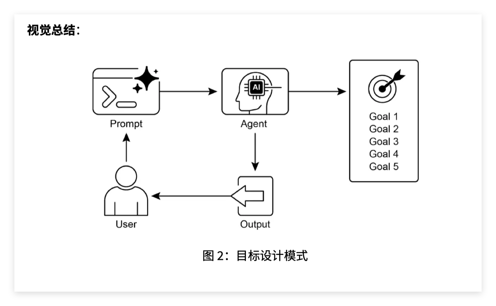

这章讲的是 **目标设定与监控模式（Goal Setting and Monitoring Pattern）**，其实不是一个神秘的新算法，而是一种 **Agent 控制结构**。

它的核心不是“让 LLM 更聪明”，而是给 Agent 外面包一层循环机制：

> 先明确目标 → 生成行动/结果 → 检查是否达标 → 不达标就带着反馈重新做 → 达标或达到上限后停止。

这份 PDF 的代码示例就是用“生成代码”这个任务来展示这种模式：Agent 接收一个编程任务和一组质量目标，然后反复生成、评审、修改代码，直到目标满足或达到最大迭代次数。

---

## 1. 这章到底在讲什么？

普通 Agent 很容易变成：

> 用户问一句，Agent 答一句；
> 用户让它做一次，它做一次；
> 做得好不好，它自己不一定知道。

而 **目标设定与监控模式（Goal Setting and Monitoring Pattern）** 要解决的是：

> Agent 不只是执行任务，还要知道“我要达成什么结果”，并且在执行过程中检查自己有没有偏离目标。

所以它关注三个问题：

第一，**目标状态（Goal State）** 是什么？
比如：“写一个能正确求 Binary Gap 的 Python 程序。”

第二，**成功标准（Success Criteria）** 是什么？
比如：

```text
代码简单易懂
功能正确
能处理边界情况
只接受正整数输入
能打印几个示例结果
```

第三，**监控机制（Monitoring Mechanism）** 是什么？
也就是 Agent 如何判断“我现在的结果是否已经满足目标”。

这章的例子里，监控不是靠真实运行测试，而是靠 LLM 自己做代码评审，然后再让 LLM 判断目标是否达成。

---

## 2. 它是如何实现“目标感”的？

这里的 **目标感（Goal Awareness）** 不是模型真的有主观目标，而是代码把目标明确写进了 Prompt。

在示例代码里，用户输入两个东西：

```python
use_case_input = "Write code to find BinaryGap of a given positive integer"

goals_input = "Code simple to understand, Functionally correct, Handles comprehensive edge cases, Takes positive integer input only, prints the results with few examples"
```

也就是：

```text
任务：写一个求 BinaryGap 的程序

目标：
- 简单易懂
- 功能正确
- 处理边界情况
- 只处理正整数输入
- 打印几个示例结果
```

然后 `generate_prompt()` 会把这些目标塞进提示词：

```python
def generate_prompt(use_case, goals, previous_code="", feedback=""):
    base_prompt = f"""
    You are an AI coding agent. Your job is to write Python code based on the following use case:

    Use Case: {use_case}

    Your goals are:
    {chr(10).join(f"- {g.strip()}" for g in goals)}
    """
```

所以它的“目标感”来自：

> 把任务目标显式写入 Prompt，让 LLM 每次生成代码时都围绕这些目标来做。

这里的关键词是：

* **目标（Goal）**：Agent 要达成的结果。
* **用例（Use Case）**：当前具体任务。
* **成功标准（Success Criteria）**：判断任务是否完成的条件。
* **提示词注入目标（Prompt-based Goal Conditioning）**：通过 Prompt 把目标传给 LLM。

---

## 3. 它是如何实现“进度感”的？

这里的 **进度感（Progress Awareness）** 主要靠两个东西：

第一，循环次数：

```python
for i in range(max_iterations):
    print(f"Iteration {i + 1} of {max_iterations}")
```

这表示 Agent 知道自己现在处于第几轮迭代。

第二，保存上一轮代码和反馈：

```python
previous_code = ""
feedback = ""
```

每一轮如果没有达标，就更新：

```python
previous_code = code
```

下一轮生成 Prompt 时，会把上一版代码和上一轮反馈都放进去：

```python
prompt = generate_prompt(
    use_case,
    goals,
    previous_code,
    feedback
)
```

也就是说，Agent 不是每次从零开始，而是带着历史状态继续改。

所以它的“进度感”不是抽象意义上的“理解进度”，而是具体实现为：

```text
当前是第几轮；
上一轮生成了什么代码；
上一轮评审指出了什么问题；
本轮应该基于这些信息继续优化。
```

关键词：

* **状态（State）**：Agent 在任务过程中的当前信息，比如上一版代码、反馈、迭代次数。
* **迭代（Iteration）**：重复执行“生成—评审—修改”的过程。
* **历史上下文（Historical Context）**：上一轮结果和反馈。
* **最大迭代次数（Max Iterations）**：防止无限循环的停止条件。

---

## 4. 它是如何实现“纠偏能力”的？

这部分是这章最重要的。

纠偏靠三个函数配合：

```python
get_code_feedback()
goals_met()
generate_prompt()
```

流程是：

```text
生成代码
↓
评审代码
↓
判断目标是否满足
↓
如果不满足，把反馈加入下一轮 Prompt
↓
重新生成代码
```

具体看。

---

### 第一步：生成代码

```python
code_response = llm.invoke(prompt)
raw_code = code_response.content.strip()
code = clean_code_block(raw_code)
```

LLM 根据任务和目标生成代码。

---

### 第二步：评审代码

```python
feedback = get_code_feedback(code, goals)
```

`get_code_feedback()` 会让 LLM 扮演代码评审员：

```python
def get_code_feedback(code: str, goals: list[str]) -> str:
    feedback_prompt = f"""
    You are a Python code reviewer. A code snippet is shown below. Based on the following goals:

    {chr(10).join(f"- {g.strip()}" for g in goals)}

    Please critique this code and identify if the goals are met.
    Mention if improvements are needed for clarity, simplicity, correctness, edge case handling, or test coverage.

    Code:
    {code}
    """
    return llm.invoke(feedback_prompt)
```

这一步就是 **监控（Monitoring）**。

它不是在真实运行代码，而是用 LLM 对代码做语义评审。

关键词：

* **监控（Monitoring）**：检查当前结果是否接近目标。
* **反馈（Feedback）**：评审后指出的问题。
* **自我评审（Self-Review）**：Agent 对自己的输出进行检查。
* **质量检查表（Quality Checklist）**：用目标列表作为检查标准。

---

### 第三步：判断是否达标

然后调用：

```python
if goals_met(feedback_text, goals):
    break
```

`goals_met()` 会再次问 LLM：

```python
Based on the feedback above, have the goals been met?

Respond with only one word: True or False.
```

如果返回 `True`，说明目标达成，循环停止。

如果返回 `False`，说明没达成，继续下一轮。

所以它的停止条件是：

```text
目标达成
或者
达到最大迭代次数
```

关键词：

* **达标判断（Goal Satisfaction Check）**
* **停止条件（Stopping Condition）**
* **布尔判断（Boolean Judgment）**：这里只允许返回 True 或 False。

---

### 第四步：不达标就带着反馈重做

如果没达标：

```python
previous_code = code
```

然后下一轮重新构造 Prompt：

```python
base_prompt += f"\nPreviously generated code:\n{previous_code}"

base_prompt += f"\nFeedback on previous version:\n{feedback}\n"
```

这就是纠偏的关键。

因为下一轮 Prompt 里面会有：

```text
上一版代码是什么；
上一版哪里不好；
这次要根据反馈修改。
```

所以它不是简单“再生成一次”，而是：

> 根据监控反馈进行修正。

关键词：

* **纠偏（Correction）**
* **重新规划（Replanning）**
* **反馈回路（Feedback Loop）**
* **基于反馈的改进（Feedback-driven Refinement）**

---

## 5. 用一张流程理解它

这章的流程可以简化成：

```text
用户输入任务和目标
        ↓
构造 Prompt
        ↓
LLM 生成代码
        ↓
LLM 评审代码
        ↓
判断是否满足目标
    ↙              ↘
 不满足             满足
  ↓                 ↓
加入反馈重新生成      保存最终代码
```

本质上就是：

```python
while not goals_met and iteration < max_iterations:
    result = generate(goal, previous_result, feedback)
    feedback = evaluate(result, goal)
    goals_met = judge(feedback, goal)
```

这个结构才是 **Goal Setting and Monitoring Pattern** 的核心。

---

## 6. 你那句话里的三个能力分别怎么落到代码上？

你说得很准确：

> 目标感：知道自己要完成什么；
> 进度感：知道当前做到哪一步；
> 纠偏能力：发现没做好时能修改计划或重新执行。

对应到代码就是：

| 能力                      | 代码实现                                                        | 本质             |
| ----------------------- | ----------------------------------------------------------- | -------------- |
| 目标感 Goal Awareness      | `use_case` + `goals` 被写进 Prompt                             | 把任务目标显式告诉 LLM  |
| 进度感 Progress Awareness  | `previous_code`、`feedback`、`for i in range(max_iterations)` | 保存历史状态，知道当前第几轮 |
| 纠偏能力 Correction Ability | `get_code_feedback()` + `goals_met()` + 下一轮重新生成             | 根据反馈修改输出       |

所以它不是通过一个单独的“目标模块”实现的，而是通过这几个东西组合出来的：

```text
目标输入
+ 状态保存
+ 评审函数
+ 达标判断
+ 循环控制
```

---

## 7. 这章代码的不足也很明显

这章自己也提醒了：这个示例只是说明原理，不是生产级代码。

主要问题有几个。

第一，**评审和生成都由同一个 LLM 完成**。
这会导致一个问题：模型可能看不出自己的错误。写代码的是它，评审代码的也是它，容易互相放过。

第二，**没有真实运行代码**。
它只是让 LLM 说代码对不对，但没有执行单元测试（Unit Test），也没有捕获运行错误。

第三，**目标判断太粗糙**。
`goals_met()` 只返回 `True` 或 `False`，但真实任务往往需要更细粒度的评分，比如：

```text
正确性：80/100
边界情况：60/100
可读性：90/100
测试覆盖率：30/100
```

第四，**监控机制比较弱**。
它监控的是文本反馈，不是真实环境状态。比如在真实 Agent 里，监控可能包括：

```text
工具调用是否成功
API 是否返回错误
数据库是否真的更新
用户是否满意
任务是否超时
成本是否超预算
```

---

## 8. 更强的实现方式应该是什么？

如果你要把这章思想迁移到真正的 Agent 项目里，可以这样理解：

### 初级版

```text
LLM 生成
LLM 自评
LLM 修改
```

就是这章的代码。

### 中级版

```text
LLM 生成
程序运行测试
LLM 根据报错修改
```

比如写代码 Agent，至少要加：

```python
subprocess.run(...)
pytest
静态检查
异常捕获
```

也就是说，监控不只靠 LLM 评价，而是靠真实执行结果。

### 高级版

```text
Planner 规划
Executor 执行
Evaluator 评估
Replanner 重新规划
Memory 保存状态
```

这就更像 LangGraph / AutoGen / CrewAI 里的 Agent 工作流。

关键词：

* **规划器（Planner）**：负责拆解任务。
* **执行器（Executor）**：负责执行具体步骤。
* **评估器（Evaluator）**：负责检查结果是否达标。
* **重规划器（Replanner）**：发现失败后修改路线。
* **记忆/状态（Memory / State）**：保存过程信息。

---

## 9. 最直观的理解

这章的模式可以一句话概括：

> 给 Agent 一个目标清单，再让它每做完一版结果就拿清单自查；如果没过，就带着检查意见重新做。

所以它真正实现的不是“智能体突然拥有目标意识”，而是工程上加了一个控制循环：

```text
目标 → 执行 → 评估 → 反馈 → 再执行
```

这就是 **目标设定与监控模式（Goal Setting and Monitoring Pattern）** 的本质。

如果之前的 Agent 是：

```text
输入 → 输出
```

那么这一章的 Agent 是：

```text
输入目标 → 生成结果 → 检查结果 → 修正结果 → 输出最终结果
```

这个变化非常关键，因为它让 Agent 从“单次回答机器”变成了“会围绕目标反复推进的任务执行系统”。



## 推荐阅读

上一篇：

> [模型上下文协议（MCP）](../10-model-context-protocol-mcp/)

下一篇：

> [异常处理与恢复](../12-exception-handling-and-recovery/)

