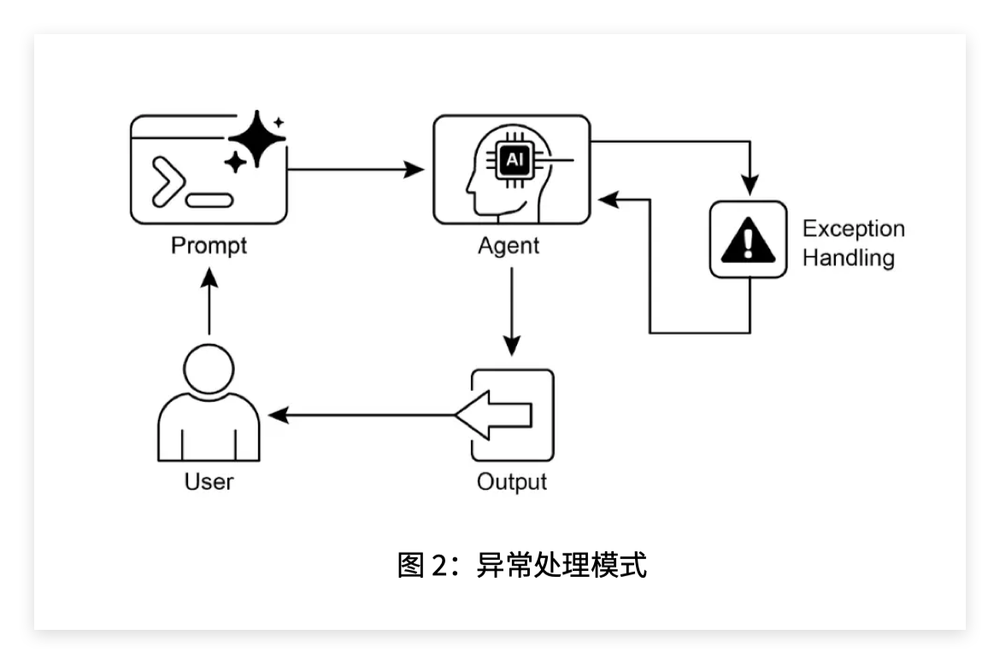

这一章讲的是 **异常处理与恢复模式（Exception Handling and Recovery Pattern）**。

它和上一章的 **目标设定与监控模式（Goal Setting and Monitoring Pattern）** 很像，都是在给 Agent 加“控制能力”。但重点不同：

上一章关心的是：

> Agent 如何围绕目标持续推进？

这一章关心的是：

> Agent 出错了、工具失败了、环境异常了，它怎么不直接崩掉？

也就是说，这章解决的是 **Agent 的可靠性（Reliability）** 和 **容错性（Fault Tolerance）** 问题。PDF 里明确说，这个模式的核心是让智能体能够检测问题、启动恢复流程，或者至少做到“受控失败”，而不是遇到异常就彻底中断。

---

## 1. 这章的核心问题是什么？

真实环境里的 Agent 不可能永远顺利。

比如：

```text
调用工具失败；
API 返回 404 / 500；
网络超时；
数据库暂时不可用；
用户输入格式不对；
工具返回内容不符合预期；
文件损坏；
网站结构变化；
设备无法响应。
```

如果没有异常处理，Agent 很可能会变成：

```text
一调用失败 → 直接报错 → 任务中断 → 用户不知道发生了什么
```

但一个可靠的 Agent 应该是：

```text
发现错误 → 判断错误类型 → 尝试处理 → 换备用方案 → 必要时通知用户或人工介入
```

所以这一章的本质是：

> 不要假设 Agent 的每一步都会成功，而是提前设计失败时该怎么办。

关键词：

* **异常（Exception）**：程序或系统运行中出现的非正常情况。
* **错误检测（Error Detection）**：发现哪里出问题。
* **错误处理（Error Handling）**：决定遇到错误后怎么应对。
* **恢复（Recovery）**：把系统拉回稳定状态。
* **容错性（Fault Tolerance）**：系统在部分失败时仍能继续工作的能力。
* **优雅降级（Graceful Degradation）**：完整功能不可用时，至少保留部分功能。

---

## 2. 这一章的三段式结构

PDF 第 2 页的图 1 把这个模式分成三个部分：

```text
Error Detection → Error Handling → Recovery
错误检测 → 错误处理 → 恢复
```

也就是：

```text
先发现问题
再处理问题
最后恢复稳定状态
```

这个顺序非常重要。很多初学者会直接理解成“try-except 捕获一下错误”，但 Agent 里的异常处理不只是写一个 `except`。

它更像一个完整的运行机制：

```text
检测：我怎么知道出错了？
处理：出错后我马上做什么？
恢复：我怎么让任务继续，或者至少体面地失败？
```

---

## 3. 第一部分：错误检测 Error Detection

**错误检测（Error Detection）** 是发现 Agent 的某一步出现问题。

在普通程序里，错误可能是 Python 抛出的异常：

```python
try:
    result = tool(input)
except Exception as e:
    ...
```

但 Agent 里的错误不一定会显式抛异常。

比如工具返回：

```json
{
  "status": "success",
  "data": null
}
```

程序层面没有报错，但对任务来说它其实失败了。

所以 Agent 的错误检测要检查很多东西：

```text
工具有没有报错；
API 状态码是不是 404 / 500；
是否超时；
返回内容是不是空；
返回格式是否符合预期；
工具输出是否与任务目标相关；
环境状态是否异常。
```

，错误检测可以通过验证工具输出、检查 API 错误码、检查服务响应时间、检查响应格式等方式实现。

举个 Agent 场景：

用户问：

```text
帮我查这个地址的精确位置。
```

Agent 调用位置工具：

```text
get_precise_location_info(address)
```

可能出现几种失败：

```text
地址不存在；
工具服务挂了；
网络超时；
工具返回空结果；
工具返回格式错误；
只能查到城市，查不到精确地址。
```

这些都属于错误检测要覆盖的范围。

---

## 4. 第二部分：错误处理 Error Handling

检测到错误之后，Agent 不能只是说“出错了”。

它需要选择一种处理策略。

这一章列了几类典型策略：

### 1. 日志记录 Logging

也就是把错误信息保存下来，方便之后排查。

例如：

```text
调用哪个工具失败了？
输入是什么？
返回了什么错误码？
错误发生在第几步？
是否重试过？
```

关键词：

* **日志记录（Logging）**：记录系统运行过程和错误信息。
* **诊断（Diagnostics）**：根据日志分析问题原因。

---

### 2. 重试 Retry

有些错误是临时性的，比如网络波动、接口超时、服务器忙。

这时候可以重试：

```text
第一次失败 → 等 1 秒 → 再试一次
第二次失败 → 等 3 秒 → 再试一次
第三次失败 → 放弃或走备用方案
```

但注意，不是所有错误都适合重试。

比如：

```text
资金不足
权限不够
用户输入非法
市场关闭
```

这些错误重复尝试没有意义，甚至可能造成风险。PDF 里自动化金融交易的例子也提到，遇到“资金不足”或“市场关闭”时，不应重复尝试无效交易，而应记录错误并通知用户或调整策略。

关键词：

* **重试（Retry）**：再次执行失败的操作。
* **临时性错误（Transient Error）**：可能自己恢复的短暂错误。
* **永久性错误（Permanent Error）**：重试也无法解决的错误。

---

### 3. 备用方案 Fallback

**备用方案（Fallback）** 是这一章代码示例的重点。

如果主工具失败，就换一个次优方案。

比如：

```text
精确地址查询失败
↓
改为查询城市级别信息
```

这就是备用方案。

它牺牲了一部分精度，但保留了任务价值。

对应到 PDF 里的 ADK 示例：

```python
primary_handler = Agent(...)
fallback_handler = Agent(...)
response_agent = Agent(...)
```

第一个 Agent 尝试查精确位置，第二个 Agent 在主查询失败时查询大致区域，第三个 Agent 负责输出最终结果。

---

### 4. 优雅降级 Graceful Degradation

**优雅降级（Graceful Degradation）** 比备用方案更宽泛。

它的意思是：

> 完整功能做不到，就提供一个较弱但仍然有用的结果。

比如：

```text
查不到精确地址 → 返回城市信息；
数据库不可用 → 告诉用户暂时无法查账单，但可以留下工单；
文件批处理遇到坏文件 → 跳过坏文件，继续处理其他文件；
网页爬虫遇到验证码 → 暂停该页面，继续抓取其他页面。
```

重点是：不要因为局部失败导致整个任务失败。

---

### 5. 通知 Notification

当 Agent 自己处理不了时，需要通知用户、人工客服、运维系统或其他 Agent。

这叫：

* **通知（Notification）**
* **升级处理（Escalation）**

比如客服机器人查账单数据库失败，它不应该胡编一个答案，而应该说：

```text
当前账单系统暂时不可用，我可以稍后重试，或帮你转人工客服。
```

这就是受控失败。

---

## 5. 第三部分：恢复 Recovery

**恢复（Recovery）** 是把系统重新拉回稳定状态。

它不只是“告诉用户失败了”，还包括：

```text
回滚状态；
重新规划；
自我修正；
切换工具；
升级人工；
恢复到上一个稳定状态。
```

比如 Agent 正在帮用户改数据库：

```text
第一步：修改用户套餐
第二步：更新账单
第三步：发送确认邮件
```

如果第二步失败，不能只停在那里。

否则系统可能变成：

```text
套餐改了，但账单没改
```

这就是状态不一致。

更好的做法是：

```text
发现第二步失败
↓
撤销第一步修改
↓
记录错误
↓
通知用户
```

这叫 **状态回滚（State Rollback）**。

关键词：

* **状态回滚（State Rollback）**：撤销最近操作，回到稳定状态。
* **自我修正（Self-Correction）**：Agent 根据错误原因调整自己的操作。
* **重新规划（Replanning）**：原方案走不通时，重新制定路线。
* **升级处理（Escalation）**：交给人工或更高级系统。

---

## 6. PDF 里的代码示例在做什么？

这一章的代码是基于 Google ADK 的 `SequentialAgent`。

它设计了三个子 Agent：

```text
primary_handler
fallback_handler
response_agent
```

结构是：

```text
主处理器 → 备用处理器 → 响应处理器
```

也就是：

```text
先尝试精确查询
如果失败，走备用查询
最后统一组织回答
```

### 第一个 Agent：primary_handler

```python
primary_handler = Agent(
    name="primary_handler",
    instruction="""
    你的任务是获取精确的位置信息。
    请使用 get_precise_location_info 工具，并传入用户提供的地址。
    """,
    tools=[get_precise_location_info]
)
```

它负责调用主工具：

```text
get_precise_location_info
```

目标是查精确地址。

如果这个工具成功，状态里应该保存精确位置结果。

如果失败，系统需要记录：

```python
state["primary_location_failed"] = True
```

虽然 PDF 的示例代码没有把工具函数和状态更新细节完全写出来，但它的设计意图就是靠状态变量判断主工具是否失败。

---

### 第二个 Agent：fallback_handler

```python
fallback_handler = Agent(
    name="fallback_handler",
    instruction="""
    检查 state["primary_location_failed"] 是否为 True。
    - 若为 True，从用户原始查询中提取城市，并使用 get_general_area_info 工具。
    - 若为 False，无需操作。
    """,
    tools=[get_general_area_info]
)
```

它不是无脑执行，而是先检查状态：

```python
state["primary_location_failed"]
```

如果主查询失败：

```text
提取城市
↓
调用 get_general_area_info
↓
获得大致区域信息
```

这就是 **备用方案（Fallback）**。

---

### 第三个 Agent：response_agent

```python
response_agent = Agent(
    name="response_agent",
    instruction="""
    查看 state["location_result"] 中的位置信息。
    请清晰简明地向用户展示这些信息。
    若 state["location_result"] 不存在或为空，请向用户致歉，说明无法获取位置信息。
    """,
    tools=[]
)
```

它负责最终输出。

它不直接调用工具，只看状态：

```python
state["location_result"]
```

如果有结果，就输出结果。

如果没有结果，就向用户说明失败。

这一步的意义是：

> 无论前面成功还是失败，最后都要给用户一个可理解的响应，而不是让系统崩掉。

---

## 7. 这个例子的本质流程

可以简化成：

```text
用户输入地址
↓
primary_handler 尝试精确查询
↓
如果成功：
    保存 location_result
↓
如果失败：
    标记 primary_location_failed = True
↓
fallback_handler 检查是否失败
↓
如果失败：
    尝试城市级别查询
↓
response_agent 读取 location_result
↓
有结果就展示
没结果就道歉并说明无法获取
```

更抽象一点：

```text
主路径 Main Path
↓ 失败
备用路径 Fallback Path
↓ 仍失败
受控失败 Controlled Failure
```

这就是异常处理与恢复模式的工程实现。

---

## 8. 它和上一章的“目标设定与监控”有什么关系？

两章其实是连续的。

上一章：

```text
目标 → 执行 → 检查进度 → 纠偏
```

这一章：

```text
执行 → 出错 → 检测 → 处理 → 恢复
```

两者都在讲 Agent 的控制结构。

区别是：

| 模式                                      | 解决的问题     | 核心机制        |
| --------------------------------------- | --------- | ----------- |
| 目标设定与监控 Goal Setting and Monitoring     | 如何持续朝目标推进 | 目标、进度、反馈、纠偏 |
| 异常处理与恢复 Exception Handling and Recovery | 出错后如何不崩溃  | 检测、处理、备用、恢复 |

实际 Agent 系统里，这两个通常会一起用。

比如代码生成 Agent：

```text
目标：生成正确代码
↓
执行：写代码
↓
监控：运行测试
↓
异常：测试失败 / 运行报错
↓
恢复：把报错交给 Agent 修改代码
↓
继续迭代
```

所以异常处理其实可以看成目标监控中的一个特殊分支：

```text
正常偏差 → 纠偏
异常失败 → 恢复
```

---

## 9. 这章最应该掌握什么？

你不需要把 ADK 代码背下来。真正要掌握的是这个设计思路：

```text
Agent 不应该假设工具一定成功。
Agent 每次调用工具后，都要检查结果。
失败后要有策略，而不是直接崩。
```

最小实现可以是：

```python
try:
    result = primary_tool(input)
except Exception as e:
    log_error(e)
    result = fallback_tool(input)

if result is None:
    return "抱歉，我暂时无法完成这个任务。"
else:
    return result
```

但在 Agent 系统里，更完整的实现是：

```text
1. 检测错误
2. 分类错误
3. 判断是否重试
4. 判断是否走备用工具
5. 判断是否降级输出
6. 判断是否需要人工介入
7. 记录日志和状态
8. 恢复到稳定状态
```

---




## 推荐阅读

上一篇：

> [目标设定与监控](../11-goal-setting-and-monitoring/)

下一篇：

> [人类参与环节](../13-human-in-the-loop/)

