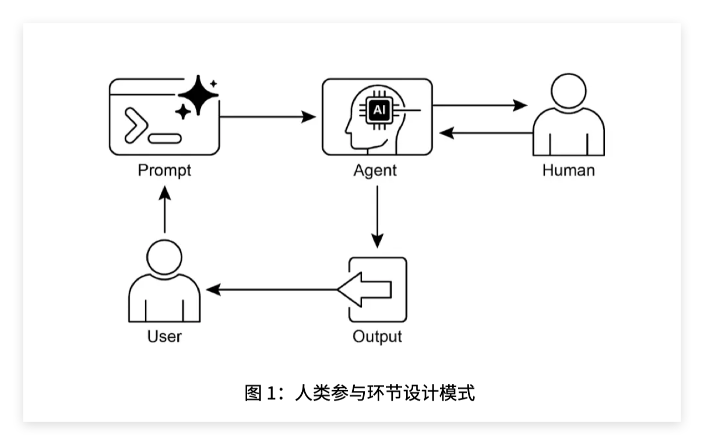

这一章讲的是 **人类参与环节（Human-in-the-Loop，HITL）**。

它的核心不是“让人类帮 AI 干活”，而是：

> 在 AI 不适合完全自主决策的地方，故意把人类放进 Agent 工作流里，让人类负责监督、判断、纠错、最终批准或接管。

也就是说，前几章一直在给 Agent 加能力：

```text
目标设定与监控：让 Agent 知道自己要做什么，并检查进度。
异常处理与恢复：让 Agent 出错后不要崩溃。
人类参与环节：让 Agent 在自己不该独断时，把问题交给人。
```

PDF 里明确说，HITL 是把人类的判断力、创造力、细致理解，与 AI 的计算能力和效率结合起来，尤其适用于复杂、模糊、高风险场景。

---

## 1. 为什么需要 HITL？

因为 Agent 再强，也有几个明显弱点：

```text
不一定理解复杂语境；
可能误判边界情况；
可能幻觉；
可能缺少伦理判断；
可能无法承担高风险决策责任；
可能不知道自己什么时候不该继续做。
```

比如：

```text
金融：AI 可以发现可疑交易，但是否冻结账户，最好让人类分析师判断。
法律：AI 可以检索案例，但不能直接替法官判决。
客服：AI 可以回答常规问题，但用户情绪激烈、问题复杂时，应转人工。
内容审核：AI 可以初筛内容，但边界内容需要人工复核。
医疗：AI 可以辅助分析，但关键诊断不能完全交给模型。
```

所以 HITL 的本质是：

> 把 AI 放在“辅助者”或“第一线处理者”的位置，把关键判断权保留给人类。

关键词：

* **人类参与环节（Human-in-the-Loop，HITL）**：人类被嵌入 AI 工作流，在关键环节提供监督、反馈、审批或接管。
* **人类监督（Human Oversight）**：人类持续观察 AI 的行为和输出。
* **人工干预（Human Intervention）**：AI 遇到复杂或高风险情况时，人类介入处理。
* **升级策略（Escalation Strategy）**：Agent 判断自己无法处理时，把任务转交给人类。
* **决策增强（Decision Augmentation）**：AI 提供分析和建议，但由人类做最终决定。

---

## 2. HITL 不是“AI 做不了就找人”这么简单

很多人会把 HITL 理解成：

```text
AI 不会了 → 转人工
```

这只是其中一种形式。

这一章讲的 HITL 至少包括六类作用。

### 第一，人类监督 Human Oversight

人类通过日志、仪表盘、审核系统观察 Agent 表现。

比如：

```text
这个 Agent 最近有没有频繁调用失败？
有没有输出不合规内容？
有没有越权操作？
有没有处理用户隐私数据？
```

这不是每一步都人工参与，而是人类在系统层面做监管。

---

### 第二，人工纠正 Human Correction

当 Agent 输出错误时，人类可以纠正它。

例如代码 Agent 生成了一段代码，表面上能运行，但有隐蔽 bug。普通用户可能看不出，但专业开发者能指出问题。

PDF 里也提醒，HITL 的效果高度依赖人类操作员的专业水平。AI 可以生成代码，但只有专业开发者才能发现细微错误并正确指导修复。

---

### 第三，人类反馈学习 Human Feedback for Learning

这个和 **RLHF（Reinforcement Learning from Human Feedback，人类反馈强化学习）** 有关。

意思是：

```text
AI 输出多个结果；
人类判断哪个更好；
系统把这种偏好作为训练或优化信号。
```

这里人类不是在处理单个任务，而是在帮助模型长期变好。

关键词：

* **人类反馈强化学习（Reinforcement Learning from Human Feedback，RLHF）**
* **偏好数据（Preference Data）**
* **人工标注（Human Annotation）**

---

### 第四，决策增强 Decision Augmentation

AI 负责整理信息、做分析、给建议，但最终决策由人类做。

比如金融贷款：

```text
AI：分析企业现金流、信用记录、行业风险；
人类信贷员：结合领导力、行业背景、定性因素，决定是否放贷。
```

AI 提高人类决策效率，但不取代人类决策权。

---

### 第五，人机协作 Human-AI Collaboration

人类和 Agent 分工合作。

比如：

```text
Agent：整理资料、检索文档、生成初稿；
人类：判断方向、修改关键表述、处理复杂谈判。
```

这里不是“谁替代谁”，而是各自做擅长的部分。

---

### 第六，升级策略 Escalation Strategy

这是 Agent 系统里最重要的工程点之一。

Agent 需要知道：

```text
什么情况可以自己处理；
什么情况必须转人工；
什么情况需要用户确认；
什么情况应该停止操作。
```

例如客服 Agent：

```text
普通退款问题 → AI 自己处理；
金额很大 → 人工审批；
用户强烈不满 → 转人工客服；
涉及法律威胁 → 升级给专门团队。
```

这一章的代码示例就是围绕“升级给人工专家”来写的。

---

## 3. Human-in-the-Loop 和 Human-on-the-Loop 的区别

PDF 里还提到一个变体：**Human-on-the-Loop**。

这两个很容易混。

### Human-in-the-Loop

人类在具体流程中参与判断。

```text
AI 做一步；
人类审核；
人类批准后继续。
```

比如：

```text
AI 标记一条内容违规；
人工审核员确认是否真的违规；
确认后再删除。
```

这里人类是在 loop 里面。

---

### Human-on-the-Loop

人类不审每个具体动作，而是制定规则、监控系统，AI 自动执行。

```text
人类制定策略；
AI 按策略高速执行；
人类在上层监督。
```

PDF 举了自动化金融交易的例子：人类金融专家制定投资策略和风险规则，AI 实时监控市场并按规则交易。

区别可以这样看：

| 模式                | 人类位置        | 适合场景        |
| ----------------- | ----------- | ----------- |
| Human-in-the-Loop | 人类参与具体决策环节  | 高风险、模糊、需要审批 |
| Human-on-the-Loop | 人类制定规则并监督系统 | 高频、实时、规则明确  |

简单说：

```text
in-the-loop：人类在流程里面逐案介入。
on-the-loop：人类在流程上方制定规则和监督。
```

---

## 4. 这一章的代码示例在做什么？

代码示例是一个 **技术支持 Agent（Technical Support Agent）**。

它有三个工具：

```python
troubleshoot_issue
create_ticket
escalate_to_human
```

分别对应：

```text
troubleshoot_issue：基础故障排查；
create_ticket：创建工单；
escalate_to_human：升级给人工专家。
```

Agent 的指令大概是：

```text
你是一家电子产品公司的技术支持专家。
先查看用户历史支持记录。
对于技术问题：
1. 用 troubleshoot_issue 分析问题；
2. 指导用户基础排查；
3. 如果没解决，创建工单；
复杂问题超出基础排查时：
1. 使用 escalate_to_human 转人工专家。
```

所以这段代码的核心不是工具本身，而是它设计了一个处理边界：

```text
普通问题：Agent 自己处理；
未解决问题：创建工单；
复杂问题：转人工专家。
```

这就是 HITL。

---

## 5. 代码里的三个工具分别承担什么角色？

### 1. troubleshoot_issue：AI 第一线处理

```python
def troubleshoot_issue(issue: str) -> dict:
    return {"status": "success", "report": f"故障排查步骤：{issue}。"}
```

这是自动化部分。

Agent 先尝试自己解决常规问题。

对应现实中的：

```text
重启设备；
检查网络；
检查设置；
查看错误码；
给出基础排查步骤。
```

---

### 2. create_ticket：无法立即解决时创建工单

```python
def create_ticket(issue_type: str, details: str) -> dict:
    return {"status": "success", "ticket_id": "TICKET123"}
```

这代表问题没有当场解决，但系统没有放弃，而是进入后续处理流程。

关键词：

* **工单（Ticket）**：记录问题、分配处理、跟踪进度的系统记录。
* **异步处理（Asynchronous Handling）**：不是马上解决，但进入后续流程。

---

### 3. escalate_to_human：转人工

```python
def escalate_to_human(issue_type: str) -> dict:
    return {"status": "success", "message": f"{issue_type} 已升级给人工专家处理。"}
```

这是 HITL 的核心。

Agent 发现自己不适合继续处理时，把问题交给人类专家。

这一步避免了两种危险：

```text
AI 硬着头皮胡说；
AI 对高风险问题做错误决策。
```

---

## 6. personalization_callback 是什么作用？

代码后半部分还有一个：

```python
def personalization_callback(callback_context, llm_request):
```

它的作用是 **个性化（Personalization）**。

它从 `state` 里取客户信息：

```python
customer_info = callback_context.state.get("customer_info")
```

然后取出：

```text
客户姓名；
客户等级；
最近购买记录。
```

再把这些信息插入 LLM 请求前面，作为系统消息：

```python
system_content = types.Content(
    role="system", parts=[types.Part(text=personalization_note)]
)
llm_request.contents.insert(0, system_content)
```

也就是说，Agent 在回答用户前，会先知道：

```text
这个用户是谁；
是不是高级客户；
最近买过什么产品；
有没有历史支持记录。
```

这让客服回答更贴近具体用户。

但注意，这里也带来隐私问题。PDF 后面也说，HITL 实施涉及隐私问题，敏感信息需要匿名化后才能暴露给人工操作员。

关键词：

* **回调函数（Callback Function）**：在模型调用前后插入自定义逻辑。
* **状态（State）**：Agent 工作流中保存的上下文信息。
* **个性化（Personalization）**：根据用户信息调整回复。
* **系统消息（System Message）**：给模型的高优先级背景信息或行为要求。

---

## 7. 这一章的流程图怎么理解？

第 6 页图 1 展示的是：

```text
User → Prompt → Agent → Human
                    ↓
                  Output → User
```

重点是 Agent 和 Human 之间有双向箭头。

这表示：

```text
Agent 可以把问题交给人；
人可以审查、修改、指导 Agent；
Agent 再把最终结果输出给用户。
```

这和普通 Agent 的区别很大。

普通 Agent：

```text
User → Agent → Output
```

HITL Agent：

```text
User → Agent → 必要时 Human 审核/接管 → Output
```

也就是说，Human 不是外部临时补救，而是架构里预留好的一个环节。

---

## 8. HITL 和上一章异常处理有什么关系？

它们关系很紧。

上一章 **异常处理与恢复（Exception Handling and Recovery）** 讲的是：

```text
工具失败了怎么办？
系统异常了怎么办？
任务做不下去了怎么办？
```

这一章 HITL 讲的是：

```text
当 Agent 自己不适合继续处理时，怎么把人类放进来？
```

所以 HITL 经常是异常恢复的一种高级策略。

比如：

```text
工具失败一次 → 重试；
重试失败 → 备用工具；
备用工具也失败 → 转人工。
```

这就是：

```text
异常处理 + HITL
```

再比如：

```text
用户问题普通 → Agent 自己答；
用户问题复杂 → 创建工单；
用户情绪激烈或涉及赔偿 → 转人工。
```

这也是：

```text
任务分流 + HITL
```

---

## 9. HITL 的缺点是什么？

这一章也没有把 HITL 说成万能方案。它明确提到几个问题。

### 第一，可扩展性差 Scalability Problem

人类处理速度有限。

AI 可以同时处理百万条请求，但人工审核员不可能同时看百万条。

所以 HITL 最大的问题是：

```text
准确性提高了，但处理量下降了。
```

关键词：

* **可扩展性（Scalability）**：系统处理更大规模任务的能力。
* **吞吐量（Throughput）**：单位时间内能处理多少任务。

---

### 第二，依赖专家水平

HITL 不是随便找个人看一眼就行。

如果是代码审核，需要开发者。

如果是金融风控，需要风控专家。

如果是医疗辅助，需要医生。

如果是法律文档，需要法律专业人士。

否则人类也可能做出低质量判断。

---

### 第三，隐私成本高

如果人类要参与，就可能看到用户数据。

这会带来：

```text
数据脱敏；
权限控制；
审计日志；
匿名化处理；
合规流程。
```

所以 HITL 在企业落地时，不只是产品流程问题，也是安全和合规问题。

关键词：

* **数据脱敏（Data Masking）**
* **匿名化（Anonymization）**
* **隐私保护（Privacy Protection）**
* **合规（Compliance）**

---

## 10. 什么时候应该用 HITL？

可以记住这个判断标准：

```text
只要 AI 的错误代价很高，就应该考虑 HITL。
```

具体包括：

```text
高风险：医疗、金融、法律、自动驾驶；
高模糊：内容审核、复杂客服、情绪判断；
高责任：需要追责、审批、合规；
高价值：大额交易、大客户服务、关键系统变更；
高不确定：模型置信度低、工具失败、信息不足。
```

反过来，如果是低风险、可自动化、错误代价低的任务，就不一定需要 HITL。

比如：

```text
自动整理标签；
普通 FAQ 回复；
生成草稿；
简单数据分类；
非关键推荐。
```

---

## 11. 最小实现版 HITL 应该怎么设计？

一个最小 HITL Agent 可以这样设计：

```text
1. Agent 先判断任务风险等级
2. 低风险任务自动处理
3. 中风险任务处理后请求用户确认
4. 高风险任务直接转人工
5. 所有人工处理结果记录下来，作为后续优化数据
```

伪代码可以是：

```python
risk = assess_risk(user_request)

if risk == "low":
    return agent_handle(user_request)

elif risk == "medium":
    draft = agent_handle(user_request)
    return ask_user_confirmation(draft)

elif risk == "high":
    return escalate_to_human(user_request)
```

这就是 HITL 的最小骨架。

---

## 12. 最直观的总结

这一章可以一句话概括：

> 让 Agent 知道：哪些事情可以自己做，哪些事情必须让人类看一眼，哪些事情必须交给人类决定。

它不是削弱 AI，而是让 AI 更可靠。

没有 HITL 的 Agent 可能是：

```text
什么都敢答，什么都敢做，错了也不知道后果。
```

有 HITL 的 Agent 是：

```text
常规任务自动做；
复杂任务请求人类；
高风险任务必须人工确认；
失败和反馈还能反过来改进系统。
```

所以这一章的本质是：

> 把 Agent 从“完全自动执行器”，升级成“有人类监督和接管机制的可靠工作流系统”。



## 推荐阅读

上一篇：

> [异常处理与恢复（Exception Handling and Recovery）]({< relref "../12-exception-handling-and-recovery/index.md" >})

下一篇：

> [知识检索（RAG）]({< relref "../14-retrieval-augmented-generation-rag/index.md" >})

