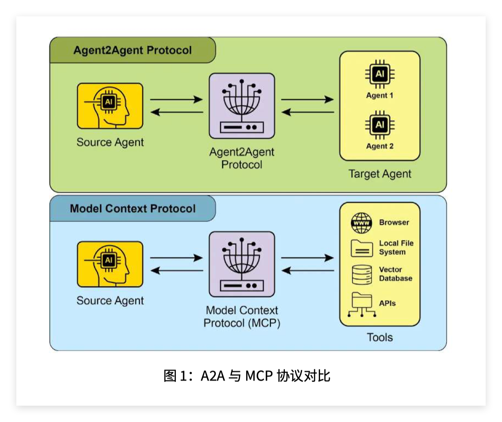
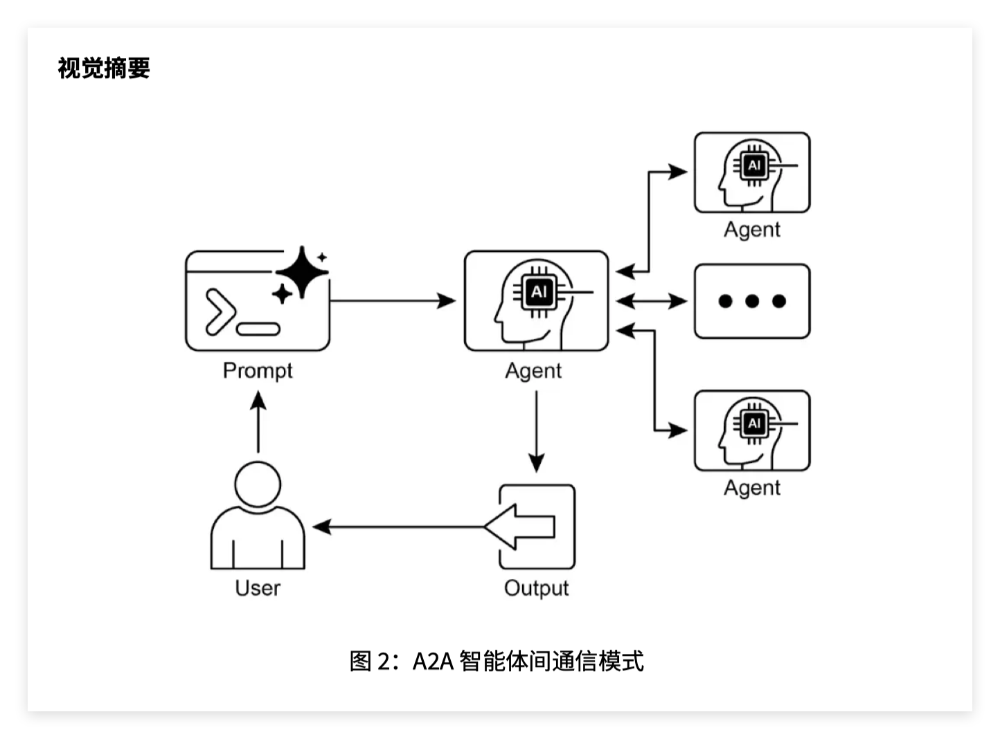

这一章讲的是 **智能体间通信（Agent-to-Agent Communication，A2A）**。

它要解决的问题是：

> 一个 Agent 再强，也不可能什么都擅长。复杂任务往往需要多个 Agent 分工合作，而 A2A 就是让不同 Agent 之间能互相发现、互相调用、互相传递任务和结果的一套通信协议。

你可以把它放在前几章的脉络里理解：

```text
RAG：让 Agent 能查外部知识；
HITL：让 Agent 必要时找人类介入；
A2A：让 Agent 必要时找另一个 Agent 协作。
```，Google 的 **A2A 协议（Agent2Agent Protocol）** 是一项开放标准，目标是让不同框架构建的智能体，比如 LangGraph、CrewAI、Google ADK 等，能够跨平台协同工作。

---

## 1. 为什么需要 A2A？

假设你要做一个复杂任务：

```text
帮我分析最近一周的销售数据，找出异常原因，然后生成一份汇报，并安排明天下午开会讨论。
```

一个单体 Agent 要做很多事：

```text
读取数据；
清洗数据；
分析异常；
解释业务原因；
生成报告；
查日历；
安排会议；
通知相关人员。
```

这就很容易变得臃肿。

更合理的做法是拆成多个专门 Agent：

```text
数据 Agent：负责取数和清洗；
分析 Agent：负责指标分析和异常检测；
报告 Agent：负责生成汇报；
日历 Agent：负责查时间和安排会议；
通知 Agent：负责发邮件或消息。
```

那么问题来了：

> 这些 Agent 怎么知道彼此存在？
> 怎么知道对方会什么？
> 怎么把任务发给对方？
> 对方处理完怎么返回结果？
> 如果任务很久才完成，怎么跟踪状态？
> 如果不同 Agent 来自不同框架，怎么统一通信？

这就是 A2A 要解决的问题。

关键词：

* **智能体间通信（Agent-to-Agent Communication，A2A）**：Agent 与 Agent 之间进行任务委托、信息交换和协作。
* **互操作性（Interoperability）**：不同框架、不同系统里的 Agent 能互相通信。
* **任务委托（Task Delegation）**：一个 Agent 把某个子任务交给另一个 Agent。
* **多智能体系统（Multi-Agent System）**：多个 Agent 分工协作完成复杂任务。

---

## 2. A2A 的本质是什么？

A2A 本质上是一套标准通信协议。

更具体地说：

```text
它规定了 Agent 怎么介绍自己；
怎么被其他 Agent 发现；
怎么接收任务；
怎么返回结果；
怎么处理长任务；
怎么做安全认证。
```

所以 A2A 不是某一个 Agent 框架，也不是一个模型，而是协议层。

类似地：

```text
MCP：规定 Agent / LLM 怎么连接工具和外部资源；
A2A：规定 Agent 怎么连接另一个 Agent。
```

PDF 里也明确说，A2A 与 Anthropic 的 **MCP（Model Context Protocol，模型上下文协议）** 是互补关系：MCP 关注 Agent 与外部数据、工具的连接；A2A 关注 Agent 之间的协调、通信、任务委托与协作。

---

## 3. A2A 里的三个核心参与者

PDF 里把 A2A 的参与者分成三类：

```text
用户 User
A2A 客户端 A2A Client
A2A 服务器 A2A Server
```

### 1. 用户 User

用户是任务的发起者。

例如：

```text
帮我看看明天上午 10 点到 11 点有没有空。
```

---

### 2. A2A 客户端 A2A Client

**A2A 客户端（A2A Client）** 通常是代表用户发出请求的 Agent。

比如一个主控 Agent 收到用户请求后，发现自己不会查日历，于是它去调用日历 Agent。

这个主控 Agent 就是 A2A Client。

---

### 3. A2A 服务器 A2A Server

**A2A 服务器（A2A Server）** 是提供能力的远程 Agent。

比如日历 Agent 对外暴露一个 HTTP 接口，可以处理“查询空闲时间”“创建会议”等任务。

这个日历 Agent 就是 A2A Server。

可以这样理解：

```text
用户：提出需求
客户端 Agent：决定要找谁帮忙
服务器 Agent：真正执行某个专业任务
```

---

## 4. Agent Card 是什么？

这一章最重要的概念是 **Agent Card（智能体卡片）**。

它可以理解为 Agent 的“能力说明书”或“数字身份”。

一个 Agent Card 通常是 JSON 文件，里面写着：

```text
这个 Agent 叫什么；
它能做什么；
它的服务地址是什么；
它支持什么输入输出格式；
它有哪些技能；
它是否支持流式输出；
它需要什么认证方式。
```

PDF 里给了一个 WeatherBot 的 Agent Card 示例，里面包括：

```python
agent_card = {
    "name": "WeatherBot",
    "description": "提供准确的天气预报和历史数据。",
    "url": "http://weather-service.example.com/a2a",
    "version": "1.0.0",
    "capabilities": {
        "streaming": True,
        "pushNotifications": False,
        "stateTransitionHistory": True
    },
    "authentication": {
        "schemes": ["apiKey"]
    },
    "skills": [...]
}
```

这个东西的意义非常大。

因为客户端 Agent 不需要知道 WeatherBot 内部是怎么实现的，它只需要看 Agent Card 就知道：

```text
它是天气 Agent；
它能查当前天气；
它能查天气预报；
它支持文本输入和文本输出；
它需要 API Key；
它的调用地址是什么。
```

关键词：

* **Agent Card（智能体卡片）**：描述 Agent 身份、能力、端点、认证方式的元数据文件。
* **能力（Capability）**：Agent 支持的通信或运行特性，比如 streaming、push notifications。
* **技能（Skill）**：Agent 能完成的具体任务，比如查询天气、检查日历空闲时间。
* **端点 URL（Endpoint URL）**：其他 Agent 调用它的 HTTP 地址。
* **认证（Authentication）**：调用该 Agent 需要的身份验证方式。

Agent Card 的本质是：

> 让 Agent 能自我介绍，并让其他 Agent 自动理解它能不能被调用。

---

## 5. Agent 发现 Agent Discovery 是什么？

有了 Agent Card，还要解决一个问题：

> 其他 Agent 怎么找到这张卡？

这就是 **Agent 发现（Agent Discovery）**。

PDF 提到了三种方式：

### 第一，Well-Known URI

比如 Agent 把自己的卡片放在固定路径：

```text
/.well-known/agent.json
```

其他 Agent 只要访问这个地址，就能读取它的能力说明。

关键词：

* **Well-Known URI（众所周知 URI）**：固定约定路径，方便自动发现服务元数据。

---

### 第二，管理型注册表 Managed Registry

企业内部可以有一个中心目录：

```text
所有可用 Agent 都把 Agent Card 注册进去。
```

主控 Agent 需要某种能力时，就去注册表里查：

```text
谁会查天气？
谁会生成报告？
谁会查日历？
谁会做财务分析？
```

关键词：

* **管理型注册表（Managed Registry）**：集中保存 Agent Card 的目录服务。
* **服务发现（Service Discovery）**：系统自动查找可用服务或 Agent。

---

### 第三，直接配置 Direct Configuration

如果系统很简单，也可以直接把 Agent Card 写死在配置里。

比如：

```text
主控 Agent 预先知道日历 Agent 的地址和能力。
```

这种方式灵活性差，但实现简单。

---

## 6. A2A 里的通信单位：Task、Message、Artifact

这一章还有几个重要对象。

### Task 任务

**任务（Task）** 是 A2A 的核心工作单元。

比如：

```text
检查明天上午 10 点到 11 点是否有空。
```

每个任务有唯一 ID，并且有状态。

常见状态包括：

```text
submitted：已提交；
working：处理中；
input-required：需要补充输入；
completed：已完成；
failed：失败。
```

长任务尤其需要状态管理。

因为有些 Agent 不能立刻返回结果，比如：

```text
生成一份长报告；
跑一次数据分析；
处理视频；
查多个系统；
等待人工审批。
```

---

### Message 消息

**消息（Message）** 是 Agent 之间传递的信息。

它可以包含：

```text
文本；
文件；
结构化 JSON；
音频；
视频；
元数据。
```

PDF 中的同步请求示例里，message 的结构大概是：

```json
{
  "role": "user",
  "parts": [
    {
      "type": "text",
      "text": "美元兑欧元汇率是多少？"
    }
  ]
}
```

关键词：

* **消息（Message）**：Agent 间传递请求、上下文或补充信息的载体。
* **内容部分（Part）**：消息中的具体内容单元，比如 text、file、json。
* **元数据（Metadata）**：描述消息属性的信息，比如优先级、创建时间。

---

### Artifact 工件

**工件（Artifact）** 是 Agent 在任务中产生的实际输出。

比如：

```text
报告文件；
分析结果；
生成的代码；
图片；
表格；
最终答案。
```

Message 更偏通信过程，Artifact 更偏任务产物。

关键词：

* **工件（Artifact）**：Agent 执行任务后生成的结果或产物。

---

## 7. A2A 用什么协议通信？，A2A 通信通过：

```text
HTTP(S) + JSON-RPC 2.0
```

这两个都很重要。

### HTTP(S)

这意味着 Agent 可以像 Web 服务一样暴露接口。

例如：

```text
http://calendar-agent.example.com/
```

其他 Agent 通过 HTTP 请求调用它。

---

### JSON-RPC 2.0

**JSON-RPC 2.0** 是一种远程过程调用协议。

它的结构一般长这样：

```json
{
  "jsonrpc": "2.0",
  "id": "1",
  "method": "sendTask",
  "params": {
    ...
  }
}
```

意思是：

```text
我要调用远程服务的某个方法 method，并传入 params。
```

关键词：

* **HTTP(S)**：基于网络的请求协议，HTTPS 带加密。
* **JSON-RPC 2.0**：用 JSON 格式进行远程方法调用的协议。
* **远程过程调用（Remote Procedure Call，RPC）**：像调用本地函数一样调用远程服务。

---

## 8. A2A 支持哪些交互方式？

这一章讲了四种。

### 第一，同步请求/响应 Synchronous Request/Response

适合很快完成的任务。

例如：

```text
查当前天气；
查一个汇率；
判断一句话情感；
查询某个日历时间段是否空闲。
```

流程是：

```text
客户端发送请求
↓
服务端立即处理
↓
一次性返回完整结果
```

PDF 中同步请求用的是：

```json
"method": "sendTask"
```

也就是发送任务并期待完整返回。

---

### 第二，异步轮询 Asynchronous Polling

适合耗时任务。

流程是：

```text
客户端提交任务
↓
服务器返回 task_id 和处理中状态
↓
客户端隔一段时间查一次状态
↓
直到任务完成或失败
```

例如：

```text
生成一份 30 页报告；
跑一次大规模数据分析；
处理一批文件。
```

关键词：

* **异步轮询（Asynchronous Polling）**：客户端定期查询任务状态。
* **任务 ID（Task ID）**：用于追踪任务的唯一标识。

---

### 第三，流式更新 Streaming / SSE

**SSE（Server-Sent Events，服务器发送事件）** 适合边生成边返回。

比如：

```text
长文本生成；
实时分析进度；
逐步返回搜索结果；
代码生成过程。
```

流程是：

```text
客户端建立连接
↓
服务端持续推送状态或部分结果
↓
客户端实时接收
```

PDF 里的流式请求用的是：

```json
"method": "sendTaskSubscribe"
```

这表示客户端订阅任务，服务端可以持续返回增量结果。

关键词：

* **流式更新（Streaming Update）**
* **SSE（Server-Sent Events，服务器发送事件）**
* **增量结果（Incremental Result）**

---

### 第四，Webhook 推送通知 Push Notification

适合非常长的任务。

流程是：

```text
客户端提交任务，并留下 webhook 地址
↓
服务端慢慢处理
↓
状态变化时主动通知客户端
```

比如：

```text
视频转写完成后通知；
大型报告生成完成后通知；
人工审批完成后通知。
```

关键词：

* **Webhook（网络回调）**：服务端在事件发生时主动调用客户端提供的 URL。
* **推送通知（Push Notification）**：服务端主动通知客户端状态变化。

---

## 9. A2A 和 MCP 的区别

这一章的图 1 很重要。

图里上半部分是 A2A：

```text
Source Agent → A2A Protocol → Target Agent
```

下半部分是 MCP：

```text
Source Agent → MCP → Tools
```

也就是说：

```text
A2A：Agent 找 Agent
MCP：Agent 找工具/资源
```

具体区别：

| 协议                         | 连接对象              | 解决问题                     |
| -------------------------- | ----------------- | ------------------------ |
| A2A Agent-to-Agent         | Agent 和 Agent     | 多智能体之间如何通信、委托任务、协作       |
| MCP Model Context Protocol | Agent/LLM 和工具/数据源 | 模型如何标准化访问外部工具、文件、数据库、API |

举例：

```text
用户：帮我查明天上午是否有空，并安排会议。
```

如果主控 Agent 自己通过 MCP 调用 Google Calendar：

```text
主控 Agent → MCP → Google Calendar 工具
```

如果主控 Agent 找一个专门的 Calendar Agent：

```text
主控 Agent → A2A → Calendar Agent → Google Calendar
```

所以 MCP 更像“工具接口标准”，A2A 更像“Agent 协作标准”。

---

## 10. A2A 的安全机制

Agent 间通信不能随便裸奔。

因为 Agent 之间可能传递：

```text
用户隐私；
企业内部数据；
日历信息；
财务数据；
工具调用权限；
身份凭证。
```

所以 PDF 提到几个安全点：

```text
mTLS；
审计日志；
Agent Card 中声明认证要求；
OAuth 2.0 Token 或 API Key；
凭证放在 HTTP Header 里，不放 URL 或消息体里。
```

关键词：

* **双向 TLS（Mutual TLS，mTLS）**：通信双方都验证彼此身份。
* **审计日志（Audit Log）**：记录谁在什么时候调用了什么。
* **OAuth 2.0**：常见授权协议。
* **API Key**：调用服务时使用的密钥。
* **HTTP Header**：HTTP 请求头，通常用于放认证信息。

安全上的核心原则是：

> 一个 Agent 能调用另一个 Agent，不代表它可以无限制调用。必须有身份认证、权限控制和日志审计。

---

## 11. 代码示例在做什么？

这一章的代码示例是一个 **日历 Agent（Calendar Agent）**。

它通过 A2A 对外暴露，让其他 Agent 可以调用它来检查用户日历空闲时间。

---

### 第一段：创建 ADK Agent

```python
async def create_agent(client_id, client_secret) -> LlmAgent:
    toolset = CalendarToolset(client_id=client_id, client_secret=client_secret)
    return LlmAgent(
        model='gemini-2.0-flash-001',
        name='calendar_agent',
        description="可帮助管理用户日历的 Agent",
        instruction=f"""
        你是一个可以帮助用户管理日历的 Agent。
        用户会请求日历状态信息或修改日历。请使用提供的工具与日历 API 交互。
        如未指定，默认使用 'primary' 日历。
        使用 Calendar API 工具时，请采用规范的 RFC3339 时间戳。
        今天是 {datetime.datetime.now()}。
        """,
        tools=await toolset.get_tools(),
    )
```

这段代码的作用是：

```text
创建一个会使用 Google Calendar API 的 Agent。
```

里面的核心是：

```python
CalendarToolset(client_id=client_id, client_secret=client_secret)
```

它给 Agent 提供日历工具。

所以这个 Agent 本身负责：

```text
查日历；
检查空闲时间；
修改日历；
使用规范时间格式。
```

关键词：

* **ADK（Agent Development Kit，智能体开发工具包）**
* **LlmAgent**：基于 LLM 的 Agent。
* **CalendarToolset**：封装 Google Calendar API 的工具集。
* **RFC3339 时间戳（RFC3339 Timestamp）**：标准时间格式，比如 `2026-05-23T10:00:00+08:00`。

---

### 第二段：定义 AgentSkill

```python
skill = AgentSkill(
    id='check_availability',
    name='检查可用性',
    description="使用 Google Calendar 检查用户某一时间段的空闲情况",
    tags=['calendar'],
    examples=['我明天上午 10 点到 11 点有空吗？'],
)
```

这段是在告诉外部：

```text
这个 Agent 有一个技能：检查日历空闲时间。
```

其他 Agent 看到这个技能，就知道：

```text
如果我需要查询用户有没有空，可以调用它。
```

---

### 第三段：定义 AgentCard

```python
agent_card = AgentCard(
    name='Calendar Agent',
    description="可管理用户日历的 Agent",
    url=f'http://{host}:{port}/',
    version='1.0.0',
    defaultInputModes=['text'],
    defaultOutputModes=['text'],
    capabilities=AgentCapabilities(streaming=True),
    skills=[skill],
)
```

这就是 Calendar Agent 的“名片”。

它声明：

```text
名字：Calendar Agent
能力：管理日历
地址：http://host:port/
输入：text
输出：text
支持：streaming
技能：check_availability
```

所以 Agent Card 是 A2A 的核心，因为它让这个 Agent 变成“可被发现、可被理解、可被调用”的服务。

---

### 第四段：Runner 和 Executor

```python
runner = Runner(
    app_name=agent_card.name,
    agent=adk_agent,
    artifact_service=InMemoryArtifactService(),
    session_service=InMemorySessionService(),
    memory_service=InMemoryMemoryService(),
)

agent_executor = ADKAgentExecutor(runner, agent_card)
```

这里可以理解为：

```text
Runner：负责运行 ADK Agent；
Executor：把 ADK Agent 包装成 A2A 可以调用的执行器。
```

也就是说，原本这个 Agent 只是 ADK 里的一个 Agent。
通过 `ADKAgentExecutor`，它被包装成 A2A 服务。

关键词：

* **Runner（运行器）**：负责执行 Agent。
* **Executor（执行器）**：处理任务调用并驱动 Agent 执行。
* **Session Service（会话服务）**：保存多轮交互上下文。
* **Memory Service（记忆服务）**：保存长期或短期记忆。
* **Artifact Service（工件服务）**：保存任务输出产物。

---

### 第五段：A2A Web 服务

```python
request_handler = DefaultRequestHandler(
    agent_executor=agent_executor,
    task_store=InMemoryTaskStore()
)

a2a_app = A2AStarletteApplication(
    agent_card=agent_card,
    http_handler=request_handler
)

app = Starlette(routes=routes)
uvicorn.run(app, host=host, port=port)
```

这部分把 Agent 变成一个 HTTP 服务。

也就是说，启动之后，其他 Agent 就可以通过网络请求调用它。

关键词：

* **Starlette**：Python Web 框架。
* **Uvicorn**：ASGI 服务器，用来运行 Web 应用。
* **Task Store（任务存储）**：保存任务状态。
* **HTTP Handler（HTTP 处理器）**：处理外部请求。

最终效果是：

```text
Calendar Agent 不再只是本地代码；
它变成了一个可通过 A2A 协议访问的远程 Agent 服务。
```

---

## 12. 这章的整体流程

可以把 A2A 工作流理解成：

```text
1. 一个 Agent 创建自己的 Agent Card
2. 它把 Agent Card 暴露出来
3. 另一个 Agent 读取 Agent Card
4. 发现它有某种技能
5. 发送任务请求
6. 远程 Agent 处理任务
7. 返回结果、流式结果或任务状态
8. 客户端 Agent 汇总结果并继续完成用户任务
```

具体到日历 Agent：

```text
主控 Agent 收到用户请求：
“我明天上午 10 点到 11 点有空吗？”

↓
主控 Agent 发现 Calendar Agent 会 check_availability

↓
通过 A2A 发送任务

↓
Calendar Agent 调用 Google Calendar API

↓
Calendar Agent 返回空闲状态

↓
主控 Agent 把结果告诉用户
```

---

## 13. A2A 适合什么场景？

### 多框架协作

比如一个系统里：

```text
LangGraph Agent 负责主流程；
CrewAI Agent 负责多角色协作；
ADK Agent 负责 Google 工具；
自研 Agent 负责企业内部系统。
```

A2A 让它们可以互相调用。

---

### 企业自动化工作流

例如：

```text
数据采集 Agent → 分析 Agent → 报告 Agent → 邮件 Agent → 日历 Agent
```

每个 Agent 专注一个环节。

---

### 动态信息请求

比如主 Agent 需要市场数据：

```text
主 Agent → 市场数据 Agent → 外部 API
```

主 Agent 不需要自己接所有 API，而是把任务委托给专业 Agent。

---

### 分布式部署

不同 Agent 可以部署在不同机器、不同团队、不同语言栈里，只要遵守 A2A 协议就能协作。

---

## 14. A2A 的价值是什么？

A2A 的主要价值是：

```text
模块化；
可扩展；
跨框架；
任务委托；
能力复用；
降低集成成本；
构建复杂多 Agent 系统。
```

没有 A2A 时，多 Agent 系统容易变成：

```text
每个 Agent 一套接口；
每个系统单独适配；
集成成本很高；
难以动态发现能力；
难以统一追踪任务。
```

有了 A2A 后，可以变成：

```text
每个 Agent 用 Agent Card 描述自己；
统一用 HTTP + JSON-RPC 通信；
统一任务格式；
统一认证方式；
统一支持同步、异步、流式等交互。
```

---

## 15. 这一章和前面几章的关系

这几章其实是在逐步把 Agent 从“单体问答模型”升级成“真实系统”。

```text
目标设定与监控：让 Agent 有目标、有进度、有纠偏；
异常处理与恢复：让 Agent 出错后能恢复；
HITL：让 Agent 必要时找人类；
RAG：让 Agent 必要时查知识；
A2A：让 Agent 必要时找其他 Agent。
```

所以 A2A 是多 Agent 系统的基础设施。

它解决的是：

```text
Agent 不再孤立工作，而是可以组成网络。
```

---

## 16. 最直观的总结

这一章可以一句话概括：

> A2A 是让 Agent 之间用统一协议互相介绍、互相发现、互相委托任务、互相返回结果的通信标准。

普通 Agent 是：

```text
用户 → Agent → 输出
```

A2A Agent 系统是：

```text
用户 → 主控 Agent → 专业 Agent A
                 → 专业 Agent B
                 → 专业 Agent C
      → 汇总结果 → 输出
```

如果说 MCP 让 Agent 能调用工具，那么 A2A 让 Agent 能调用另一个 Agent。

这就是这一章的重点：

```text
MCP = Agent 连接工具
A2A = Agent 连接 Agent
```

真正做复杂 Agent 项目时，这个思想很重要。因为你不一定要写一个“全能 Agent”，更实际的方式是：

> 写多个能力清晰的专用 Agent，然后通过 A2A 把它们组织成一个协作系统。




## 推荐阅读

上一篇：

> [知识检索（RAG）]({< relref "../14-retrieval-augmented-generation-rag/index.md" >})

下一篇：

> [资源感知优化]({< relref "../16-resource-aware-optimization/index.md" >})

