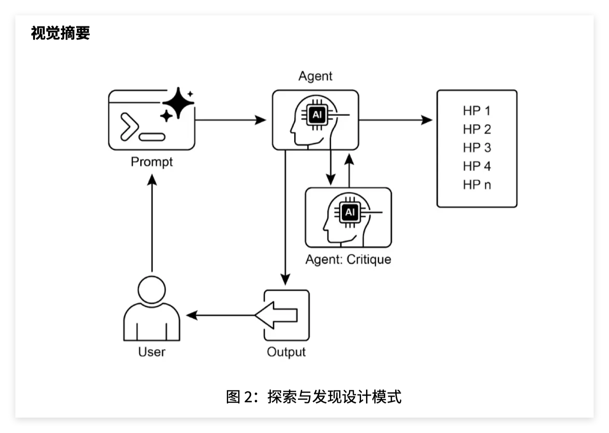

这一章是 **第 21 章：探索与发现（Exploration and Discovery）**。它讲的是：Agent 不只是完成用户已经明确给出的任务，还可以主动寻找新信息、提出新假设、发现新机会，甚至识别那些一开始根本不知道要找什么的东西，也就是文中说的 **“未知的未知（unknown unknowns）”**。

这一章比第 20 章更“开放”。第 20 章优先级排序解决的是：

```text
已经有很多任务了，先做哪个？
```

第 21 章探索与发现解决的是：

```text
任务、方向、假设、机会还不明确，Agent 能不能主动找出新的可能性？
```

---

# 1. 这一章的核心：从“执行任务”到“发现问题”

普通 Agent 更像：

```text
用户给目标 → Agent 拆解 → Agent 执行
```

探索型 Agent 更像：

```text
用户给一个开放方向
  ↓
Agent 主动查资料
  ↓
提出假设
  ↓
评估假设
  ↓
改进假设
  ↓
设计实验或行动方案
  ↓
发现新知识 / 新机会
```

所以这一章的关键词不是“完成任务”，而是 **主动探索（active exploration）** 和 **知识发现（knowledge discovery）**。

文档开头说，探索与发现不同于反应式行为，也不同于在预定义解空间里的优化。它的核心是智能体主动进入陌生领域，尝试新方法，并生成新的知识或理解。

这句话很重要。

也就是说，这章不是在讲：

```text
我已经知道目标，怎么找到最优解？
```

而是在讲：

```text
我还不知道有哪些可能方向，怎么主动发现有价值的新方向？
```

---

# 2. 探索与发现和优先级排序有什么关系？

第 20 章讲 **优先级排序（Prioritization）**，第 21 章讲 **探索与发现（Exploration and Discovery）**。

二者关系是：

```text
探索与发现：产生新的候选方向、新假设、新任务
优先级排序：从这些候选方向里选出最值得继续投入的
```

比如科研 Agent 读了很多论文，提出了 20 个候选假设。

接下来就要排序：

哪个更有新颖性？
哪个更可验证？
哪个实验成本更低？
哪个潜在影响更大？
哪个风险更小？

所以探索和排序是配套的。

没有探索，Agent 只能在已有选项里优化。
没有排序，Agent 会被大量可能性淹没。

---

# 3. 什么场景需要探索与发现？

文档列了几个应用场景，我按理解重新解释。

## 3.1 科学研究自动化

这是本章最核心的场景。

科研不是简单执行任务，而是要提出新假设。

比如：

```text
某种药物是否可以用于另一种疾病？
某个基因是否和某种疾病机制有关？
某种材料结构是否有新性质？
```

Agent 可以：

读文献；
找不同论文之间的潜在联系；
提出假设；
设计实验；
分析结果；
继续修正假设。

文档后面讲的 Google Co-Scientist 和 Agent Laboratory 都是围绕这个方向展开的。

---

## 3.2 游戏策略生成

比如 AlphaGo 这类系统，不只是重复人类已有棋谱，而是探索新的状态空间，发现人类没怎么下过的策略。

这里的探索是：

```text
尝试新走法
模拟结果
评估收益
保留高价值策略
淘汰低价值策略
```

---

## 3.3 市场调研与趋势发现

市场分析 Agent 可以扫描：

社交媒体；
新闻；
行业报告；
用户评论；
竞品动态；
搜索趋势。

目标不是回答一个固定问题，而是发现：

新消费趋势；
用户痛点；
潜在市场机会；
竞品策略变化；
异常舆情信号。

这类任务的特点是：一开始未必知道要找什么。

---

## 3.4 安全漏洞发现

安全 Agent 可以主动检查代码库、系统配置、网络流量，寻找潜在漏洞。

这也是探索型任务，因为漏洞通常不是显式写在需求里的。

---

## 3.5 创意内容生成

创意领域也需要探索。

比如：

探索不同风格组合；
探索新的音乐结构；
探索新的故事设定；
探索视觉主题和叙事方式。

这里的“发现”不是科学事实，而是新的可能表达。

---

# 4. 这一章最重要的案例：Google Co-Scientist

本章重点讲了 **Google Co-Scientist（Google AI 联合科学家）**。

它是 Google Research 开发的科学协作 AI 系统，目标是辅助人类科学家进行：

假设生成；
方案完善；
实验设计；
科研推理。

文档说，它基于 Gemini LLM 构建，主要解决科研中的挑战：处理海量信息、生成可验证假设、管理实验规划。

你可以把它理解成：

> 一个多智能体科研团队，用 AI 模拟“提出假设—评审假设—排序假设—改进假设—设计验证”的科研过程。

它不是直接替科学家做最终实验，而是帮助科学家在早期研究阶段更快探索可能方向。

---

# 5. Google Co-Scientist 的多智能体架构

文档说 Google Co-Scientist 采用 **多智能体框架（multi-agent framework）**。里面有多个专职智能体，每个 Agent 负责不同研究角色。

核心角色有这些：

## 5.1 生成智能体

**生成智能体（Generation Agent）** 负责提出初步假设。

它会通过：

文献探索；
已有知识综合；
模拟科学辩论；
跨领域联想。

来产生候选研究假设。

比如：

```text
某药物 A 可能通过机制 B 影响疾病 C。
```

这一步对应探索的起点。

---

## 5.2 反思智能体

**反思智能体（Reflection Agent / Review Agent）** 类似同行评审。

它不负责提出新假设，而是评估假设：

是否正确；
是否新颖；
是否有质量；
是否有逻辑漏洞；
是否可验证；
是否已有文献支持或反驳。

这和第 17 章的 **自我纠错（Self-Correction）**、第 19 章的 **LLM-as-a-Judge** 都有关。

---

## 5.3 排序智能体

**排序智能体（Ranking Agent）** 负责比较和排序假设。

文档说它采用 **Elo 排名（Elo Ranking）**，通过模拟辩论比较、排序和优先假设。

Elo 原本常用于棋类或竞技评分。这里可以理解为：

```text
让假设之间两两比较
赢的假设分数上升
输的假设分数下降
最终得到一个假设排行榜
```

这样系统就不会对所有假设平均用力，而是把更多资源投入高潜力方向。

---

## 5.4 进化智能体

**进化智能体（Evolution Agent）** 负责优化高排名假设。

它会做：

简化概念；
综合不同观点；
探索非常规推理；
改写假设；
增强可验证性。

这一步很像“假设进化”。

不是生成一次就结束，而是：

```text
初始假设 → 评审 → 修改 → 再评审 → 再修改
```

---

## 5.5 邻近智能体

**邻近智能体（Proximity Agent）** 负责计算假设之间的相似性，构建邻近图，聚类相似观点，辅助探索假设空间。

它解决的问题是：

```text
这些假设哪些其实很像？
哪些属于同一类思路？
哪些方向被重复探索了？
哪些区域还没被探索？
```

这可以减少重复，也可以发现空白区域。

---

## 5.6 元评审智能体

**元评审智能体（Meta-Review Agent）** 综合所有评审和辩论结果，识别共性反馈，推动系统持续改进。

它像一个总评审：

```text
哪些假设整体更强？
评审意见有什么共性？
系统下一轮应该往哪里探索？
```

---

# 6. 第 2 页图 1 怎么理解？

第 2 页图 1 展示的是 Google Co-Scientist 从构思到验证的结构。图里有 scientist 输入研究目标，然后系统内部有 supervisor、generation、review、ranking、evolution、proximity、meta-review 等 Agent，右边还有 research ideas tournament，即研究想法锦标赛。

可以抽象成：

```text
人类科学家提出研究问题
  ↓
Supervisor Agent 协调
  ↓
Generation Agent 生成假设
  ↓
Review Agent 评审假设
  ↓
Ranking Agent 排名假设
  ↓
Evolution Agent 改进假设
  ↓
Meta-Review Agent 总结反馈
  ↓
高质量候选假设进入验证
```

这张图的重点是：

> 探索不是随机乱试，而是有生成、评审、排序、进化的结构化循环。

也就是说，这章讲的探索不是“随便探索”，而是 **结构化探索（structured exploration）**。

---

# 7. “生成—辩论—进化”流程是什么？

文档说，Google Co-Scientist 遵循 **生成-辩论-进化（generate-debate-evolve）** 的迭代流程，模拟科学方法。

可以理解为：

```text
生成：提出多个候选假设
辩论：让不同智能体评估、比较、质疑
进化：保留高质量假设并继续优化
```

这和科学研究很像。

科学不是：

```text
想到一个假设 → 直接相信
```

而是：

```text
想到多个假设
  ↓
互相比较
  ↓
接受批评
  ↓
修改假设
  ↓
设计验证
```

所以 Co-Scientist 的关键在于把科研中的“同行评议”和“迭代改进”变成多 Agent 工作流。

---

# 8. 测试时计算扩展在这里有什么用？

文档提到 Google Co-Scientist 采用 **测试时计算扩展（test-time compute scaling）**，动态分配更多计算资源以迭代优化输出。

这个概念你在第 17 章已经见过。

意思是：

> 模型不只是一次生成，而是在推理阶段花更多计算，生成更多候选、做更多评审、进行更多轮优化，从而提高结果质量。

在这里就是：

```text
多生成一些假设
多比较几轮
多做几次进化
多跑几个评审智能体
```

代价是成本和时间增加，但结果可能更好。

这和第 16 章资源感知优化也有关：高价值科研任务值得花更多计算资源。

---

# 9. 文中提到的验证结果怎么理解？

文档列了不少 Google Co-Scientist 的验证结果，包括 GPQA、专家评审、生物医学实验等。这里你不用死记数字，但要理解意义。

文档提到，在 GPQA 基准测试中，系统内部 Elo 评分与结果准确率高度一致，“钻石集”难题 top-1 准确率达 78.4%；在 200 多个研究目标中，测试时计算扩展可持续提升假设质量；在生物医学专家评估中，输出被认为更具新颖性和影响力。

这些结果想说明：

```text
系统内部的排序机制不是随便排的，它和真实质量有相关性。
多花推理计算确实能提升假设质量。
多智能体评审和进化可能帮助生成更有价值的科研想法。
```

但你也要注意：这类结果不能理解成“AI 已经完全替代科学家”。文档后面也强调它是增强人类研究，而不是完全自动化。

---

# 10. 三个端到端实验案例

文档提到三个生物医学方向的实验验证。

## 10.1 药物再利用

**药物再利用（Drug Repurposing）** 指把已有药物用于新的疾病。

比如系统针对急性髓性白血病 AML 提出了新药物候选 KIRA6，后续体外实验证实 KIRA6 及其他建议药物能抑制多种 AML 细胞系中的肿瘤细胞活性。

这里的重点不是药物细节，而是：

```text
Agent 提出假设 → 实验验证 → 部分假设被证实
```

这是探索与发现最强的证明方式。

---

## 10.2 新靶点发现

系统发现了肝纤维化的新表观遗传靶点，并在人源肝类器官实验中验证了相关药物的抗纤维化活性。

这说明 Agent 不只是做文献摘要，而是在提出可能的新研究方向。

---

## 10.3 抗菌耐药性

系统被要求解释为什么某些移动遗传元件 cf-PICIs 广泛存在于多种细菌中。两天内系统提出了和噬菌体尾部相互作用、扩展宿主范围相关的解释，而这与独立研究团队多年后实验验证的发现一致。

这里想表达的是：

```text
AI 系统可能通过大规模文献综合和假设搜索，提前发现人类研究中隐藏的规律。
```

---

# 11. Co-Scientist 的局限性

这一章没有一味吹系统，也讲了限制。

文档说，它强调增强人类研究，而非完全自动化。研究者可以通过自然语言与系统互动，反馈、贡献观点并引导 AI 探索，实现 **科学家在环（Scientist-in-the-Loop）**。同时，系统局限包括：只依赖开放文献，可能遗漏付费墙后的重要成果；对负面实验结果获取有限；底层 LLM 可能出现事实错误或幻觉。

这几个点很重要。

## 11.1 只看开放文献

很多关键知识可能在：

付费论文；
实验室内部数据；
未发表结果；
失败实验记录；
专利；
行业数据库。

如果 Agent 访问不到，就可能得出不完整结论。

## 11.2 缺少负面实验结果

科学里“失败结果”很重要。

比如某个方向已经被很多实验否定，但这些结果可能没发表。Agent 只看公开正面文献，会高估某些假设。

## 11.3 LLM 幻觉

底层 LLM 可能生成错误事实、错误引用、错误机制解释。

所以科研 Agent 必须有验证机制，不能只靠生成。

---

# 12. 安全性为什么重要？

文档专门提到安全：所有研究目标和生成假设都要安全审查，防止系统被用于不安全或不道德研究。初步安全评估中，系统能有效拒绝危险输入。

这和第 18 章护栏直接相关。

探索型 Agent 风险更大，因为它不仅回答已知问题，还会主动提出新方法。
如果用于生物、化学、网络安全等领域，可能产生双重用途风险。

所以探索与发现系统必须有：

输入审核；
研究目标审核；
输出假设审核；
专家在环；
权限限制；
实验边界；
安全策略。

---

# 13. Agent Laboratory 是什么？

本章第二个案例是 **Agent Laboratory**。

文档说，它是一个自主科研工作流框架，目标是增强而非取代人类科学研究。它利用专用 LLM 自动化科研各阶段，让研究者把更多精力放在构思和批判性分析上。

它更像一个“AI 科研流水线”。

主要阶段包括：

```text
文献综述
实验阶段
报告撰写
知识共享
```

---

# 14. Agent Laboratory 的四个阶段

## 14.1 文献综述

**文献综述（Literature Review）** 阶段，Agent 自动收集和分析相关论文，比如利用 arXiv 等数据库，识别、综合、分类研究，为后续实验建立知识基础。

这对应科研中的“先看已有工作”。

---

## 14.2 实验阶段

**实验阶段（Experimentation）** 包括：

实验设计；
数据准备；
实验执行；
结果分析。

文档说，智能体可以调用 Python 代码生成与执行、Hugging Face 模型访问等工具，实现自动化实验，并根据实时结果迭代优化实验流程。

这和第 17 章的 PAL / 代码执行关系很强。

---

## 14.3 报告撰写

**报告撰写（Report Writing）** 阶段，系统把实验结果和文献综述结合，生成结构化研究报告，并集成 LaTeX 等工具实现专业排版和图表。

这相当于自动生成论文草稿。

---

## 14.4 知识共享

**知识共享（Knowledge Sharing）** 阶段通过 AgentRxiv 平台，支持自主研究智能体共享、访问和协作推进科学发现。

这部分比较前沿，可以理解为“Agent 之间共享研究成果的仓库”。

---

# 15. 三智能体评审机制

文档给了一个 `ReviewersAgent` 代码片段，里面有三个评审角色：

```text
评审 1：关注实验是否带来研究洞见
评审 2：关注研究是否对领域有影响
评审 3：关注是否有前所未有的新观点
```

这三个评审分别调用 `get_score`，最后返回三份评审意见。

这体现了一个思想：

> 对开放式探索任务，单一评审视角不够，需要多个评价维度。

比如一篇研究报告可能：

实验扎实但不新颖；
新颖但不够严谨；
有影响力但表达不清；
清晰但贡献有限。

所以多评审可以更全面。

---

# 16. get_score 评分函数在做什么？

`get_score` 的示例里定义了评审输出格式，包括：

Summary；
Strengths；
Weaknesses；
Originality；
Quality；
Clarity；
Significance；
Questions；
Limitations；
Ethical Concerns；
Soundness；
Presentation；
Contribution；
Overall；
Confidence；
Decision。

这些字段基本模拟学术会议评审。

这和第 19 章 **LLM-as-a-Judge（LLM 作为评审者）** 直接相关。

不过这里更复杂，因为评审对象是研究计划和论文报告，而不是普通问答。

核心思想是：

```text
生成结果以后，不直接接受，而是让评审智能体按照结构化标准打分。
```

---

# 17. Agent Laboratory 的多智能体角色

文档后面列了几个角色。

## 17.1 教授智能体

**教授智能体（Professor Agent）** 是研究总负责人。

它负责：

制定研究议程；
定义问题；
分配任务；
整合知识、代码、报告和笔记；
生成 README 等总结材料。

它类似科研项目 PI。

---

## 17.2 博士后智能体

**博士后智能体（Postdoc Agent）** 负责具体研究执行。

包括：

文献综述；
实验设计；
实验实施；
结果解读；
论文撰写。

它是主要产出研究成果的角色。

---

## 17.3 评审智能体

**评审智能体（Reviewer Agent）** 负责检查研究成果质量、有效性和科学性，模拟同行评审。

---

## 17.4 机器学习工程智能体

**机器学习工程智能体（Machine Learning Engineer Agent）** 负责数据预处理、实验代码生成等工程任务。

---

## 17.5 软件工程智能体

**软件工程智能体（Software Engineer Agent）** 指导 ML 工程师写代码，保证代码简洁、贴合研究目标。

这里可以看出，Agent Laboratory 是在模拟一个小型科研团队：

```text
Professor：定方向
Postdoc：做研究
ML Engineer：写实验代码
Software Engineer：指导工程实现
Reviewers：做同行评审
```

这就是多智能体协作在科研场景中的应用。

---

# 18. 第 8 页图 2 怎么理解？

第 8 页图 2 是 **探索与发现设计模式（Exploration and Discovery Design Pattern）**。图里大致是：

```text
User → Prompt → Agent → 多个 HP
              ↓
        Agent: Critique
              ↓
            Output
```

其中 HP 可以理解为 hypothesis，也就是多个候选假设。

这张图表达的是：

```text
用户提出开放问题
  ↓
Agent 生成多个假设 HP1, HP2, HP3...
  ↓
Critique Agent 批判和评估这些假设
  ↓
保留、改进、输出更好的结果
```

所以探索与发现的基本结构是：

```text
生成候选 → 批判评估 → 选择/进化 → 输出
```

这和 Google Co-Scientist 的“生成—辩论—进化”是一致的。

---

# 19. 探索与发现和 ReAct 的区别

ReAct 主要是：

```text
我有一个任务，边想边调用工具完成它。
```

探索与发现更像：

```text
我有一个开放方向，主动寻找可能任务、假设和机会。
```

比如用户问：

```text
请总结这篇文章。
```

这是普通任务，不需要探索发现。

用户问：

```text
帮我找一个值得做的 Agent 项目方向，最好能体现简历价值。
```

这就需要探索发现，因为方向不固定，需要扫描可能性、比较机会、提出假设、排序。

---

# 20. 探索与发现和 RAG 的区别

普通 RAG 是：

```text
用户问问题 → 检索相关文档 → 生成答案
```

探索型 RAG 是：

```text
开放问题
  ↓
生成多个检索方向
  ↓
检索不同来源
  ↓
发现信息空白
  ↓
提出新假设
  ↓
继续检索验证
  ↓
形成洞见
```

比如市场调研：

普通 RAG 回答：

```text
这个行业有哪些主要公司？
```

探索型 Agent 会做：

```text
哪些细分需求正在增长？
哪些用户抱怨频繁但还没被满足？
哪些竞品功能变化暗示新趋势？
哪些地区数据异常？
```

它不只是找答案，而是找“可能有价值的问题”。

---

# 21. 探索与发现的核心难点

这章看起来很宏大，但真正落地有几个难点。

## 21.1 搜索空间太大

开放问题没有明确边界，Agent 可能探索无限多方向。

所以需要优先级排序、预算控制和停止条件。

## 21.2 容易幻觉

探索型任务鼓励新想法，但新想法不等于事实。

所以必须区分：

```text
事实
推测
假设
待验证结论
```

## 21.3 评估困难

已知问题可以用标准答案评估。
开放发现没有唯一标准答案。

所以要用：

专家评审；
LLM-as-a-Judge；
实验验证；
长期效果指标；
多维度评分。

## 21.4 安全风险更高

探索型 Agent 可能发现或生成危险方法，比如漏洞利用、生物化学风险等。

所以要配合第 18 章护栏。

## 21.5 成本高

多轮生成、评审、排序、进化需要大量模型调用。

所以要配合第 16 章资源感知优化。

---

# 22. 这一章和前几章的关系

这一章几乎把前面的内容都用上了。

## 和第 16 章资源感知优化

探索任务很耗资源，所以要决定：

生成多少假设；
评审多少轮；
用什么模型；
什么时候停止；
哪些方向值得继续投入。

## 和第 17 章推理技术

探索需要：

CoT 分析；
ToT 多路径探索；
ReAct 调工具查资料；
Self-Correction 修正假设；
PAL 执行实验代码。

## 和第 18 章护栏

探索可能进入高风险领域，所以要有：

研究目标审核；
假设安全审查；
工具权限限制；
人类专家在环。

## 和第 19 章评估监控

探索结果要评估：

假设新颖性；
可验证性；
影响力；
事实支持；
实验结果；
长期价值。

## 和第 20 章优先级排序

探索会产生大量候选假设，需要排序：

哪个最重要；
哪个最可行；
哪个最有影响力；
哪个最值得验证。

---

# 23. 这一章在面试/项目里的实际价值

这章不一定是普通 Agent 面试最常规的基础题，但它适合用来解释高级 Agent 项目。

尤其是：

科研 Agent；
市场调研 Agent；
投资研究 Agent；
安全漏洞分析 Agent；
竞品分析 Agent；
内容创意 Agent；
Deep Research Agent。

如果你做项目，可以把它转化成一个比较现实的项目描述：

> 构建一个探索型 Research Agent。系统会针对开放问题生成多个研究假设，调用搜索和文档检索工具收集证据，再通过 Critic Agent 按新颖性、可行性、证据强度和潜在影响进行评分，最后输出优先级排序后的研究方向。

这个就比普通 RAG 更有 Agent 味道。

---

# 24. 如果被问：探索与发现模式是什么？

可以这样回答：

> 探索与发现模式让 Agent 不只是响应用户请求，而是主动寻找新信息、新假设和新机会。它适合开放式、复杂或快速变化领域，尤其是解空间不明确的任务。典型做法是通过多智能体协作生成候选假设，再由评审、排序和进化智能体进行批判、排名和改进，最后输出更有价值、更可验证的发现。

---

# 25. 如果被问：它和普通优化有什么区别？

可以这样回答：

> 普通优化是在已经定义好的解空间里寻找更优解，而探索与发现是在解空间尚不明确时主动扩展候选空间。前者解决“已知选项里哪个最好”，后者解决“还有哪些我们没想到的可能性”。

这句话很关键。

---

# 26. 如果被问：如何设计一个探索型 Agent？

可以这样答：

> 我会设计一个多智能体工作流。首先由 Generator Agent 根据用户问题和已有资料生成多个候选假设；然后由 Search/Retrieval Agent 收集证据；再由 Critic Agent 从事实支持、新颖性、可行性、风险和潜在影响等维度评审；Ranking Agent 对候选假设排序；Evolution Agent 对高分假设进行改写和扩展；最后由 Writer Agent 输出优先级排序后的发现和验证建议。整个过程需要预算控制、停止条件、安全审查和人工专家反馈。

这个回答基本覆盖本章核心。

---

# 27. 最后总结

第 21 章的核心是：

> Agent 不只是执行明确任务，还可以主动探索未知领域，生成假设、评估假设、改进假设，并辅助人类发现新知识。

最重要的流程是：

```text
开放问题
  ↓
生成多个候选假设
  ↓
搜索证据
  ↓
批判评审
  ↓
排序筛选
  ↓
进化改进
  ↓
实验或进一步验证
  ↓
输出发现
```

最重要的关键词是：

**探索与发现（Exploration and Discovery）**
**未知的未知（Unknown Unknowns）**
**主动探索（Active Exploration）**
**假设生成（Hypothesis Generation）**
**假设评审（Hypothesis Review）**
**假设排序（Hypothesis Ranking）**
**假设进化（Hypothesis Evolution）**
**Google Co-Scientist（Google AI 联合科学家）**
**测试时计算扩展（Test-Time Compute Scaling）**
**科学家在环（Scientist-in-the-Loop）**
**Agent Laboratory**
**多智能体科研工作流（Multi-Agent Scientific Workflow）**

这一章真正的价值是：它把 Agent 从“自动执行器”提升到“知识探索伙伴”。但是它也更依赖评估、护栏、预算控制和人类专家反馈，否则很容易变成高成本、高幻觉、高风险的系统。



## 推荐阅读

上一篇：

> [优先级排序](/p/优先级排序/)

