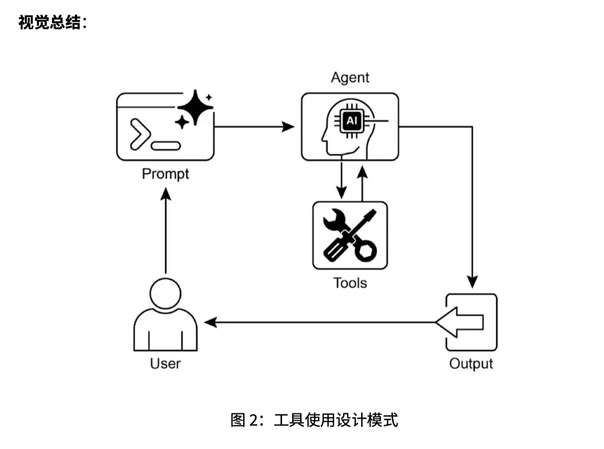

这一章讲的是 **工具使用（Tool Use）/ 函数调用（Function Calling）**。核心意思很简单：**LLM 本身只会根据已有上下文生成文本，但智能体（Agent）如果要查实时信息、算东西、查数据库、发邮件、控制外部系统，就必须借助外部工具。** 这一章就是在讲：LLM 如何决定调用工具，以及框架如何真正执行工具。

---

## 1. 这章的核心问题：LLM 为什么需要工具？

普通大语言模型（Large Language Model，LLM）有几个天然限制：

第一，它的知识不是实时的。比如你问“今天伦敦天气怎么样”，模型不能只靠训练数据回答，因为天气是动态变化的。

第二，它不能自己真正执行动作。比如“帮我发一封邮件”“查询订单状态”“关掉客厅灯”，这些都不是纯文本生成，而是要连接外部系统。

第三，它不适合做高精度计算。比如复杂数学计算、代码运行、数据分析，最好交给计算器、Python、数据库或分析工具。

所以 **工具使用（Tool Use）** 的本质是：

> 让 LLM 从“只会说话的模型”，变成“能调用外部能力完成任务的智能体”。

PDF 里也明确说，工具使用突破了 LLM 训练数据的限制，让它可以访问最新信息、执行计算、操作用户数据或触发现实世界动作。

---

## 2. 工具使用的完整流程

这一章给了一个标准流程，可以理解成 6 步：

### 第一步：工具定义（Tool Definition）

开发者先告诉模型：你有哪些工具可以用。

比如定义一个天气工具：

```python
get_weather(location: str) -> str
```

并告诉模型：

这个工具用于查询某个城市的当前天气，参数是地点 location。

这里的重点不是模型真的会执行函数，而是模型先知道：**存在这么一个工具，什么时候该用它，参数应该怎么填。**

---

### 第二步：LLM 决策（LLM Decision）

用户问：

> 伦敦天气如何？

LLM 判断：这个问题需要实时天气信息，不能靠自己编。

于是它决定调用天气工具。

---

### 第三步：生成函数调用（Function Call Generation）

模型不会直接执行函数，而是生成一个结构化请求，通常是 JSON（JavaScript Object Notation，JavaScript 对象表示法）：

```json
{
  "tool_name": "get_weather",
  "arguments": {
    "location": "London"
  }
}
```

也就是说，模型负责决定：

调用哪个工具，以及传什么参数。

---

### 第四步：工具执行（Tool Execution）

真正执行工具的不是 LLM，而是外面的智能体框架或编排层。

关键词：

* **编排层（Orchestration Layer）**
* **智能体框架（Agent Framework）**
* **执行器（Executor）**

比如 LangChain、LangGraph、CrewAI、Google ADK 这些框架会看到模型生成的工具调用请求，然后真的去运行 Python 函数、调用 API、查数据库。

---

### 第五步：观察结果（Observation / Tool Result）

工具执行完后，把结果返回给智能体。

比如天气 API 返回：

```text
伦敦当前天气多云，15°C。
```

---

### 第六步：LLM 处理结果并回复用户

模型拿到工具结果之后，再组织自然语言回复：

> 伦敦当前天气多云，气温约 15°C。

所以整个流程是：

```text
用户问题
→ LLM 判断是否需要工具
→ LLM 生成工具调用请求
→ 框架执行工具
→ 工具返回结果
→ LLM 整理结果并回答
```

这个流程是本章最重要的东西。

---

## 3. “函数调用”和“工具调用”有什么区别？

这章也区分了两个概念：

### 函数调用（Function Calling）

更狭义。

通常指模型调用一个预定义函数，比如：

```python
get_stock_price("AAPL")
```

它偏向代码层面：函数名、参数、返回值。

---

### 工具调用（Tool Calling）

更广义。

工具不一定只是 Python 函数，也可以是：

* API 接口（Application Programming Interface，应用程序编程接口）
* 数据库查询（Database Query）
* 搜索引擎（Search Engine）
* 代码解释器（Code Interpreter）
* 邮件系统（Email API）
* 另一个智能体（Another Agent）

所以可以这样理解：

> 函数调用是工具调用的一种实现方式；工具调用是更大的概念。

PDF 里也说，“函数调用”准确描述调用特定预定义代码函数的过程，但“工具调用”更具包容性，可以包括复杂 API、数据库请求，甚至面向其他智能体的指令。

---

## 4. 这一章列举了哪些应用场景？

PDF 里给了几个典型场景。

### 场景一：外部信息检索（External Information Retrieval）

比如：

> 伦敦天气如何？

模型调用天气 API。

重点：凡是实时信息，通常都需要工具。

---

### 场景二：数据库和 API 交互（Database and API Interaction）

比如：

> X 产品还有库存吗？

模型调用库存 API 或数据库。

这类场景很常见于电商、客服、企业内部系统。

---

### 场景三：计算与数据分析（Computation and Data Analysis）

比如：

> 当前 AAPL 股价是多少？买 100 股要多少钱？

模型可能先调用股票 API，再调用计算器工具。

这里对应你之前学的 Agent 项目也很重要，因为很多 Agent 不是只聊天，而是要能：

```text
查数据 → 算指标 → 生成结论
```

---

### 场景四：发送通讯（Communication）

比如：

> 给 John 发一封会议邮件。

模型需要提取：

* 收件人（Recipient）
* 主题（Subject）
* 正文（Body）

然后调用邮件 API。

---

### 场景五：执行代码（Code Execution）

比如：

> 这段 Python 代码会输出什么？

模型可以调用代码解释器，在沙箱环境中运行代码。

关键词：

* **代码解释器（Code Interpreter）**
* **沙箱环境（Sandbox Environment）**

沙箱环境的意思是：代码不是直接在危险的真实系统里运行，而是在受限制的环境里运行。

---

### 场景六：控制外部系统或设备

比如：

> 关闭客厅灯。

模型调用智能家居 API，把命令传给具体设备。

这一类已经不是“问答”，而是“行动”。

---

## 5. 第 3 页和第 12 页的图怎么理解？

图里大概是这个结构：

```text
User 用户
  ↓
Prompt 提示词
  ↓
Agent 智能体
  ↔
Tools 工具
  ↓
Output 输出
  ↓
User 用户
```

这张图想表达：

用户不是直接调用工具，而是先把需求交给 Agent。

Agent 里面的 LLM 判断：

要不要用工具？用哪个工具？参数是什么？

工具执行后，把结果返回给 Agent。

Agent 再把结果整理成用户能理解的回答。

所以图的重点是：

> 工具不是替代 LLM，而是被 LLM 调度；LLM 负责理解和决策，工具负责外部执行。

---

## 6. LangChain 示例在做什么？

PDF 里的 LangChain 示例定义了一个工具：

```python
@langchain_tool
def search_information(query: str) -> str:
    ...
```

这个工具叫 `search_information`，作用是根据 query 返回模拟搜索结果。

例如：

```python
"capital of france": "法国的首都是巴黎。"
"weather in london": "伦敦当前天气多云，气温 15°C。"
```

然后代码把这个工具绑定给模型：

```python
agent = create_tool_calling_agent(llm, tools, agent_prompt)
agent_executor = AgentExecutor(agent=agent, verbose=True, tools=tools)
```

这里有几个关键词：

### `@tool` / `@langchain_tool`

这是 **工具装饰器（Tool Decorator）**。

它的作用是把一个普通 Python 函数包装成 LangChain 能识别的工具。

---

### `create_tool_calling_agent`

这是创建一个会调用工具的智能体。

也就是说，这个 Agent 不只是普通聊天模型，而是可以根据用户问题决定是否调用工具。

---

### `AgentExecutor`

这是 **智能体执行器（Agent Executor）**。

它负责真正运行整个流程：

```text
模型思考 → 生成工具调用 → 执行工具 → 拿到结果 → 继续让模型回答
```

所以你可以把 LangChain 这一段理解为：

> 先定义工具，再把工具交给模型，最后用 AgentExecutor 管理模型和工具之间的交互。

---

## 7. CrewAI 示例在做什么？

CrewAI 示例定义了一个股票价格查询工具：

```python
@tool("股票价格查询工具")
def get_stock_price(ticker: str) -> float:
    ...
```

然后创建一个金融分析师 Agent：

```python
financial_analyst_agent = Agent(
    role='高级金融分析师',
    goal='使用工具分析股票数据并报告关键价格。',
    tools=[get_stock_price],
)
```

再定义一个任务：

```python
analyze_aapl_task = Task(
    description="苹果（AAPL）当前模拟股价是多少？请用工具查找。",
    agent=financial_analyst_agent,
)
```

最后把 Agent 和 Task 放进 Crew：

```python
financial_crew = Crew(
    agents=[financial_analyst_agent],
    tasks=[analyze_aapl_task],
)
```

CrewAI 的思路更偏“角色 + 任务”：

```text
工具：查股票价格
Agent：金融分析师
Task：查 AAPL 股价
Crew：组织 Agent 执行任务
```

和 LangChain 相比，CrewAI 更强调多智能体协作和任务分配。

---

## 8. Google ADK 示例在做什么？

PDF 里讲了 Google ADK 的几类工具。

### 第一类：Google Search 工具

这个 Agent 可以调用 Google 搜索来回答问题。

适合：

```text
最新新闻
实时信息
网络资料
```

---

### 第二类：代码执行工具（Code Execution Tool）

PDF 里有一个计算器 Agent：

```python
code_executor=BuiltInCodeExecutor()
```

它收到数学表达式后，会写 Python 代码并执行。

例如：

```text
计算 (5 + 7) * 3
```

Agent 会生成代码、运行代码，然后返回结果。

这个场景的重点是：

> LLM 不直接心算，而是用 Python 得到确定结果。

---

### 第三类：Vertex AI Search

这是企业搜索场景。

关键词：

* **Vertex AI Search**
* **企业搜索（Enterprise Search）**
* **私有知识库检索（Private Knowledge Base Retrieval）**

它适合公司内部文档问答，比如：

> 总结 Q2 战略文档的要点。

这和你学的 RAG（Retrieval-Augmented Generation，检索增强生成）关系很大。

区别是：

* 普通搜索：查互联网
* Vertex AI Search：查企业内部数据源
* RAG：一般指“检索相关文档 + 让模型基于文档回答”的架构思想

---

## 9. Vertex 扩展和函数调用的区别

PDF 最后提到：

**Vertex AI Extensions（Vertex AI 扩展）** 是一种结构化 API 封装，可以让模型连接外部 API，实现实时数据处理和动作执行。

它和普通函数调用的区别在于：

### 函数调用（Function Calling）

模型生成调用请求，但通常需要开发者或客户端自己执行函数。

流程是：

```text
模型：我要调用 get_weather
框架/客户端：好，我帮你执行
```

### Vertex AI Extensions

更偏平台级集成，工具执行、权限、安全、企业集成都封装得更完整。

所以它更适合企业应用。

---

## 10. 你需要真正掌握什么？

这章代码很多，但你不需要每个框架都手敲一遍。你真正要掌握的是下面这个结构：

```text
工具定义 Tool Definition
↓
模型选择工具 Tool Selection
↓
生成结构化调用 Structured Function Call
↓
框架执行工具 Tool Execution
↓
返回观察结果 Observation
↓
模型整合并回答 Final Response
```

这里最重要的关键词是：

* **工具使用（Tool Use）**
* **工具调用（Tool Calling）**
* **函数调用（Function Calling）**
* **工具定义（Tool Definition）**
* **结构化输出（Structured Output）**
* **JSON（JavaScript Object Notation）**
* **智能体执行器（Agent Executor）**
* **编排层（Orchestration Layer）**
* **观察结果（Observation）**
* **外部 API（External API）**

---

## 11. 用一段师生对话理解

学生：老师，为什么 Agent 需要工具？LLM 不是已经很聪明了吗？

老师：因为 LLM 的聪明主要体现在语言理解、推理和生成上，但它不能天然访问实时世界，也不能自己操作外部系统。

学生：比如？

老师：比如你问“今天台北天气如何”，如果没有天气 API，模型只能猜。再比如你说“帮我发邮件”，模型可以写邮件内容，但真正发送邮件需要邮件系统 API。

学生：所以工具就是外部能力？

老师：对。工具可以是搜索引擎、数据库、计算器、Python 解释器、邮件 API、股票 API、企业知识库，甚至另一个 Agent。

学生：那 LLM 是不是直接运行工具？

老师：不是。LLM 通常只是生成一个结构化调用请求。比如：

```json
{
  "name": "get_weather",
  "arguments": {
    "location": "Taipei"
  }
}
```

真正执行这个请求的是 Agent 框架或编排层。

学生：那框架执行完后呢？

老师：工具返回结果，比如“台北今天多云，26°C”。然后 LLM 再把这个结果组织成自然语言回复给用户。

学生：所以 LLM 负责判断和组织语言，工具负责执行？

老师：对，这就是工具使用的核心分工。

---

## 12. 最直观理解

这一章的本质可以压缩成一句话：

> **工具使用（Tool Use）就是让 LLM 在需要外部能力时，不再自己瞎编，而是生成一个结构化请求，让外部工具真正完成查询、计算或动作，然后再根据工具结果回答用户。**

对 Agent 来说，工具调用是非常核心的能力。没有工具，Agent 只是一个会聊天的模型；有了工具，Agent 才开始具备“查、算、写、发、控、执行”的能力。



## 推荐阅读

上一篇：

> [工具使用（Tool Use）/ 函数调用（Function Calling）]()

下一篇：

> [规划（Planning）]()


